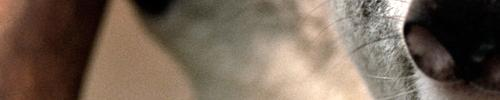

### **描述**

从指定位置对图片进行裁剪，从而生成子图片

### **接口**

    GET /${ObjectKey}?imageView&crop=${x}_${y}_${width}_${height} 
    HTTP/1.1

### **参数**

| **名称** |	                      **描述**                        	|           **取值范围**          |
|----------|------------------------------------------------------------|---------------------------------|
|   corp   |                         裁剪的关键字	                    |                                 |
|   x,y    |               裁剪起始坐标，超出图片范围会报错	            |小于等于图片右下角的坐标         |
|width,high|裁剪的长和宽，超出图片大小会采用起始坐标到右下角的长宽距离	|大于0                            |
### **示例**

效果图：

http://img-sample.nos-eastchina1.126.net/Koala.jpg?imageView&crop=0_500_500_100

