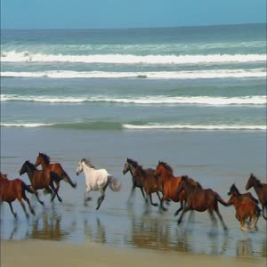

### **视频截图**

#### **描述**
获取视频的关键帧，以vframe作为操作标识。

#### **接口**

    GET /${ObjectKey}?vframe 
    HTTP/1.1

#### **参数**
|**名称**|	                       **描述**                            |**是否必须**|
|--------|-------------------------------------------------------------|------------|
|vframe|	视频截图的操作标记	|是|
|offset|	从第几秒开始截，缺省为0|	否|
|resize|	widthxheight,宽和高|	否|
|crop|	crop=x_y_width_height 表示从原坐标(x, y)处截取width*height的子图片|	否|
|type|	图片格式，默认为jpg|	否|
#### **示例**
效果图：http://img-sample.nos-eastchina1.126.net/sample.wmv?vframe&offset=1&resize=300x300&type=jpg

