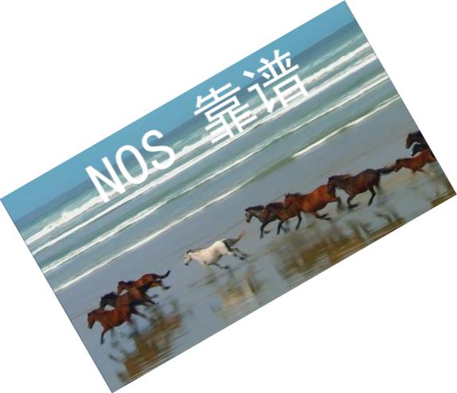

# 链式处理

### **基本链式处理**

#### **描述**
用于需要对图片进行连续多个操作时，各个操作之间按序排列并用&作为分隔符连接。

如需对图片进行以下顺序操作： 内缩略=>裁剪=>高斯模糊 则url参数如下排列：

?imageView&thumbnail=100x100&crop=50_50_100_100&blur=20x1

#### **示例**
效果图：http://img-sample.nos-eastchina1.126.net/Koala.jpg?imageView&crop=0_500_500_100&blur=20x1&thumbnail=300x100

#### **通道**

#### **描述**
图片操作大类: vframe,watermark,imageView之间支持链式处理，分割符为管道”|”。

* vframe输入必须为视频，输出为图片，故其输出可作为watermark和imageView的输入
* imageView和watermark的输入和输出皆为图片，故可以任意组合进行管道处理
#### **支持类型**
链式处理支持场景如下，操作顺序为先列后行：

|**step1step2**|**imageView**|**watermark**|**gifGen**|**vframe**|**audioTrans**|**vinfo**|**imageInfo**|
|--------------|-------------|-------------|----------|----------|--------------|---------|-------------|
|imageInfo|	YES|	YES|	NO|	NO|	NO|	NO|	NO|
|watermark|	YES|	YES|	NO|	NO|	NO|	NO|	NO|
|gifGen|	YES|	YES|	NO|	NO|	NO|	NO|	NO|
|vframe	|YES	|YES	|NO	|NO	|NO	|NO	|NO|
|audioTrans|	NO|	NO|	NO|	NO|	NO|	NO|	NO|
|vinfo	|NO	|NO	|NO	|NO	|NO	|NO	|NO|
|imageInfo|	NO|	NO|	NO|	NO|	NO|	NO|	NO|
注意：

管道”|”在URL中编码为”%7c”

#### **示例**
操作依次为：取关键帧 => 缩略 => 打水印 => 旋转：

效果图: http://img-sample.nos-eastchina1.126.net/sample.wmv?vframe&offset=2%7CimageView&thumbnail=500x500%7Cwatermark&type=2&text=Tk9TIOmdoOiwsQ==&fontsize=1500&gravity=north%7CimageView&rotate=330

