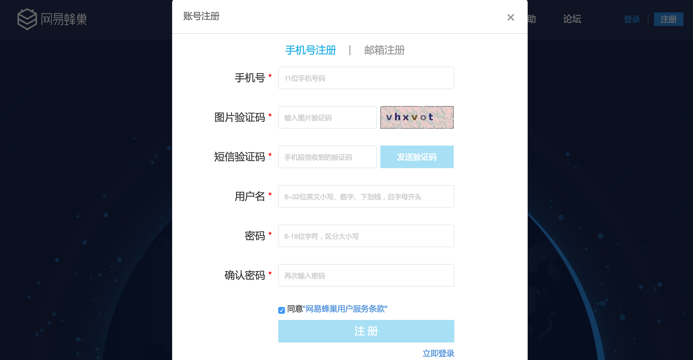
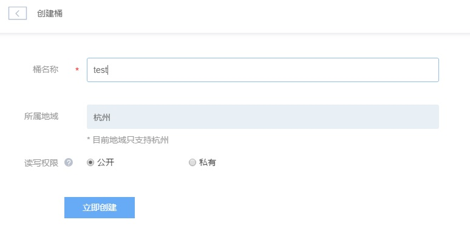
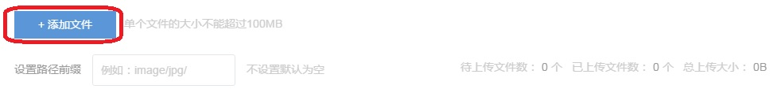
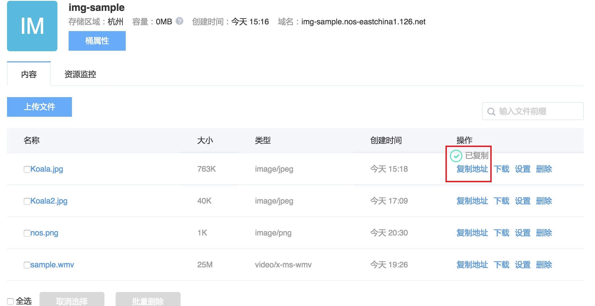
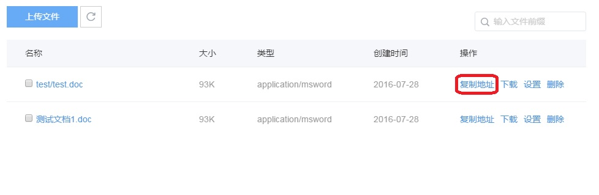
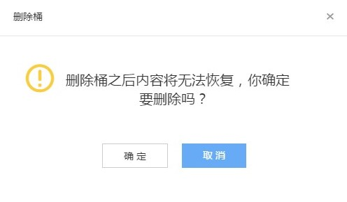

# 快速入门

NOS（Netease Object Storage）网易对象存储为你提供基于互联网的数据存取服务，通过使用 NOS，你可以随时通过网络将你的文本、图片、音视频等各类文件存储到 NOS 系统中，并 随时可以通过网络进行安全访问。

在使用 NOS 之前你需要了解如下概念：

* 桶： NOS 的对象容器，所有的对象（文件）必须放入桶中，桶名称 NOS 全局唯一，桶内对象 Key 唯一。
* 对象 key：每个对象（文件）拥有桶内唯一的 key，类比于文件名，key 由用户自定义，对象 存取接口通过 key 来操作。

你可以通过 NOS 提供的管理控制台使用我们提供的功能，详见 [控制台手册](http://support.c.163.com/wiki/md.html#!平台服务/对象存储/控制台手册/管理存储空间.md) ，当然若你是开发人员，需要将我们强大的存储服务整合到你的业务系统中，你需要使用我 们提供的各类 SDK 或者 HTTP RestFul API。

以下文档将向你介绍如何使用 NOS 产品管理控制台来完成基本的操作。

### **注册登录**

注册成功登录之后，通过以下 URL 登录到 NOS 控制台 https://c.163.com/dashboard#/m/nos/

### **创建桶**

在概览页点击「创建桶」，进入创建桶页面（创建桶需要开启手机安全验证）。 如下图所示：

**1.填写桶名称**

    桶名称不可与已有桶重名

**2.选择地域**

    目前只支持杭州区域，后续会提供更多的区域以供选择

**3.选择读写权限**

    私有:读写桶内资源需要通过认证

    公开:所有人均可访问该桶资源，但是写数据仍然需要通过认证

**4.完成创建** 点击立即创建即可完成桶创建

### **上传文件**

如下图所示，点击上传文件，进入下图所示页面，支持通过拖拽或者点击「添加文件」的方式上传文件。

### **分享文件**

如果你想将上传的文件分享给你的朋友和同事，可以通过如下复制链接按钮，将文档链接分享给 你的朋友。

### **删除文件**

如果你不再需要存储所上传的文件，请将其删除以免进一步产生费用。你可以通过 NOS 控制台删除单个文件或批量删除文件。

如下图所示，可以通过两种方式删除文件：

1.复选框多选文件，点击“批量删除”，按照提示进行二次确认，即可批量删除文件。

2.在文件行，点击“删除”，即可删除单个文件。

### **删除桶**

只有桶内没有数据时，才能被删除。 在桶所在行点击删除，按照提示进行二次确认和安全验证可将桶删除。

