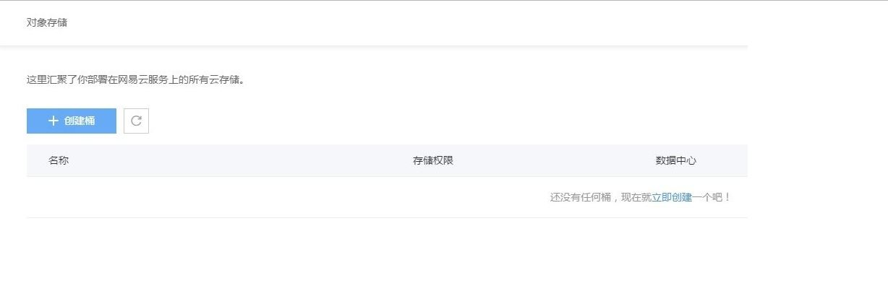
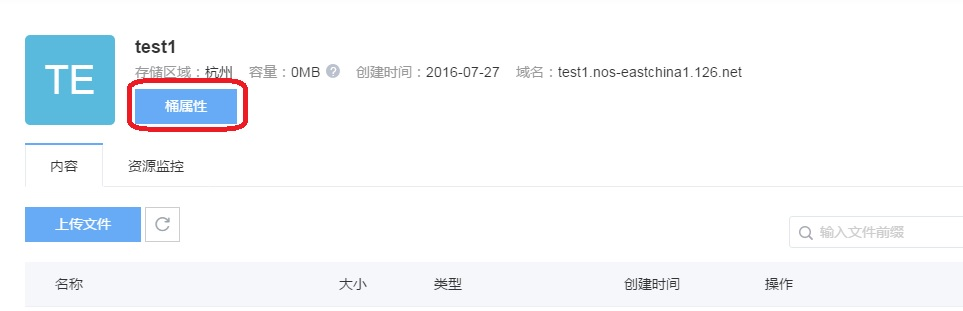
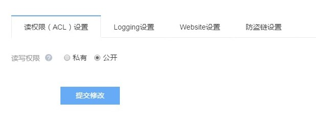
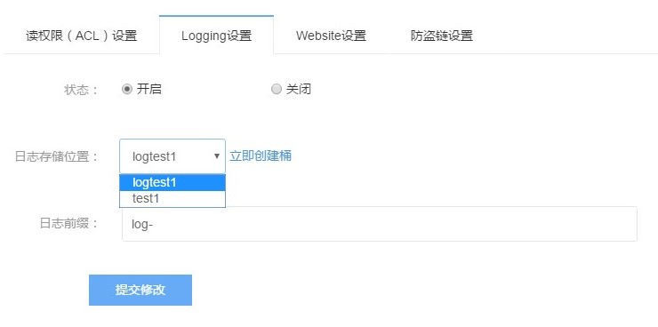
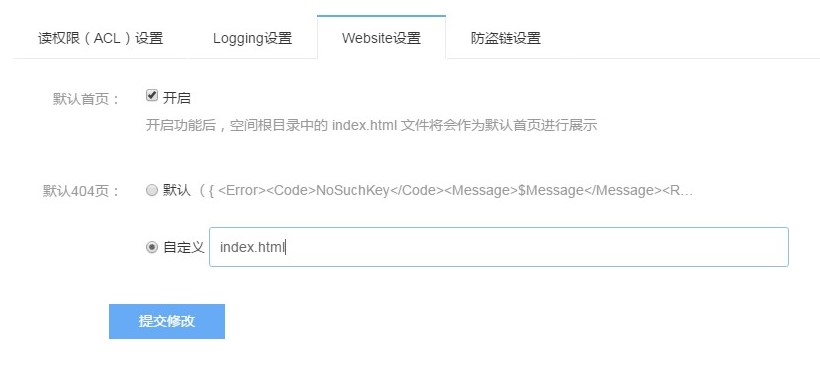
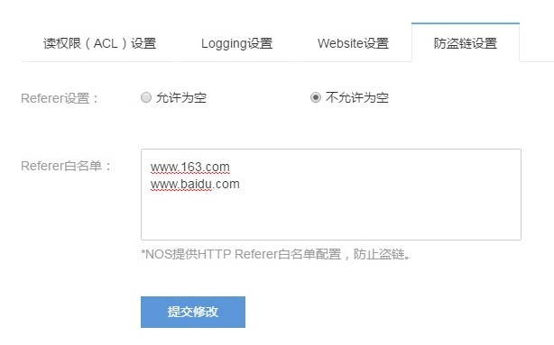

### **概览**

如下图所示，点击左侧边栏“对象存储”进入概览页。

### **创建桶**

* 填写桶名称
      桶名称不可与已有桶重名

* 选择地域
      目前只支持杭州区域，后续会提供更多的区域以供选择

* 选择读写权限
      私有:读写桶内资源需要通过认证

      公开:所有人均可访问该桶资源，但是写数据仍然需要通过认证

* 完成创建
      点击立即创建即可完成桶创建

### **桶属性**

### **读权限 ( ACL ) 设置**
在概览页点击桶进入桶详情页

在上图中点击“桶属性”进入桶属性页，默认进入读权限设置。 在本页中可以变更桶的读权限，变更后点击“提交修改”完成配置。

### **Logging 设置**
Logging 功能默认关闭，可以选择开启，开启后，日志文件将以小时粒度存储。

1. 开启后可以选择日志存储位置，日志必须存储在一个已经存在的桶中，可以选择现有桶或者创建一个新的桶

2. 填写日志文件的前缀，每小时的日志文件都将以此前缀为对象名的起始。

3. 点击“提交修改”完成配置

### **Website 设置**
NOS 支持静态网站托管。用户可以将自己的存储空间配置成静态网站模式。 为了使用户更方便地管理在 NOS 上托管的静态网站，NOS 支持两种模式：

1. 默认首页支持，NOS 默认将 index.html 作为桶空间的首页，目前不支持自定义设置首页。

2. 默认 404 页支持，通过指定错误页面，你可以为你的用户提供恰当的出错提示，同时也支持默认 404 页。

3. 点击“提交修改”完成配置

### **防盗链设置**
为了防止用户在 NOS 上的公开数据资源被其他人盗链，NOS 支持基于 HTTP header 中表头字段 referer 的防盗链方法。 如下图所示，可以对一个桶设置 referer 字段的白名单和是否允许 referer 字段为空的请求访问。 例如，对于一个名为 test1 的 bucket，设置其 referer 白名单为 www.163.com 和 www.baidu.com 并且设置 Referer 不允许为空。 则所有 referer 为 www.163.com 或者 www.baidu.com 的请求才能访问 test1 这个桶中的 object 。 填写信息后点击“提交修改”完成配置

### **删除桶**

只有桶内没有数据时，才能被删除。 在桶所在行点击删除，按照提示进行二次确认和安全验证可将桶删除。

