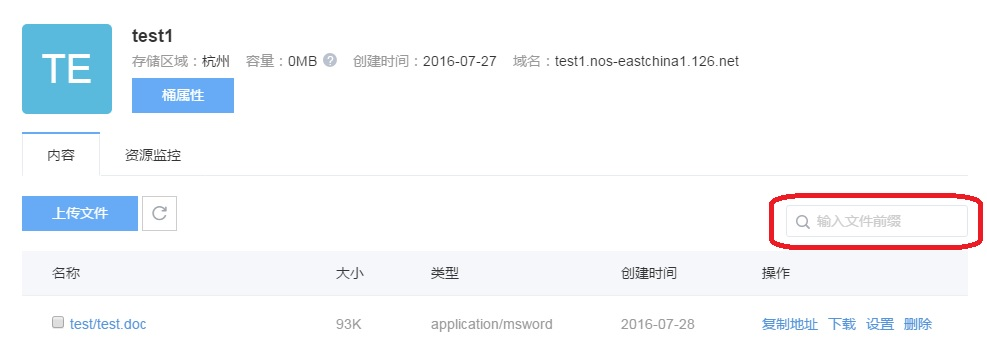
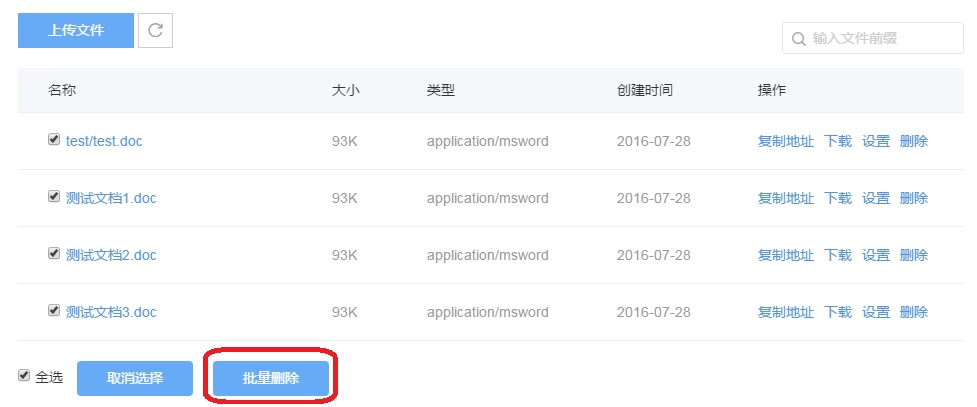
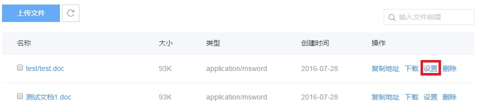
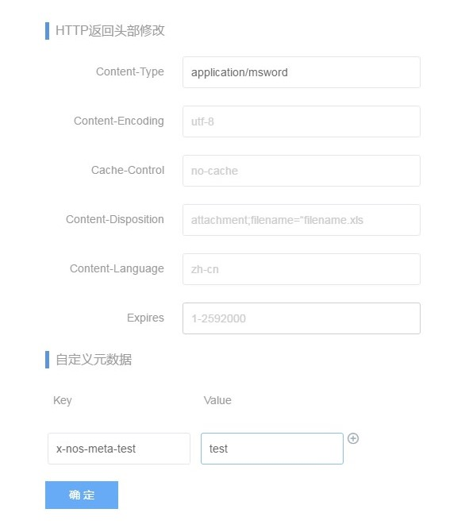

# 管理文件

NOS 支持在控制台对文件进行上传、删除等管理操作。

### **上传文件**

如下图所示，点击上传文件，进入下图所示页面，支持通过拖拽或者点击“添加文件”的方式上传文件，控制台上传文件只支持100MB以下大小的文件。

### **搜索文件**

本部分介绍如何使用 NOS 管理控制台在存储空间或文件夹中搜索具有相同的名称前缀的对象。 按名称前缀进行搜索时，搜索字符串将区分大小写。

### **获取文件访问地址**

您已经将文件上传到存储空间中，现在您可以通过获取已上传文件的地址进行文件的分享和下载。

在下图中点击复制地址可获取文件的访问地址

### **删除文件**

如果您不再需要存储所上传的文件，请将其删除以免进一步产生费用。您可以通过 NOS 控制台删除单个文件或批量删除文件。

控制台只显示前1000个文件。如果想更灵活的选择删除的文件，实现更大批量的删除，您可以使用命令行小工具或者SDK进行操作。

如下图所示，可以通过两种方式删除文件： 

* 复选框多选文件，点击“批量删除”，按照提示进行二次确认，即可批量删除文件。 
* 在文件行，点击“删除”，即可删除单个文件。

### **设置文件头属性**

您可以通过 NOS 控制台设置单个文件 HTTP 头和自定义元数据。

如上图所示，在文件所在行点击设置按钮，进入下图所示页面。

1.HTTP返回头信息可按照实例和需求进行填写

2.自定义元数据可以添加多条

3.HTTP返回头信息和自定义元数据信息可以一起设置，也可以分别单独设置

4.完善需要设置的相关信息后单击“确定”保存设置信息。

