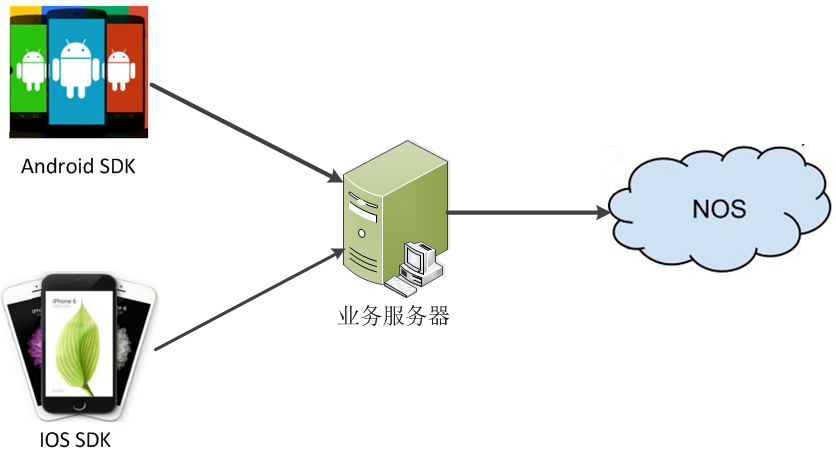
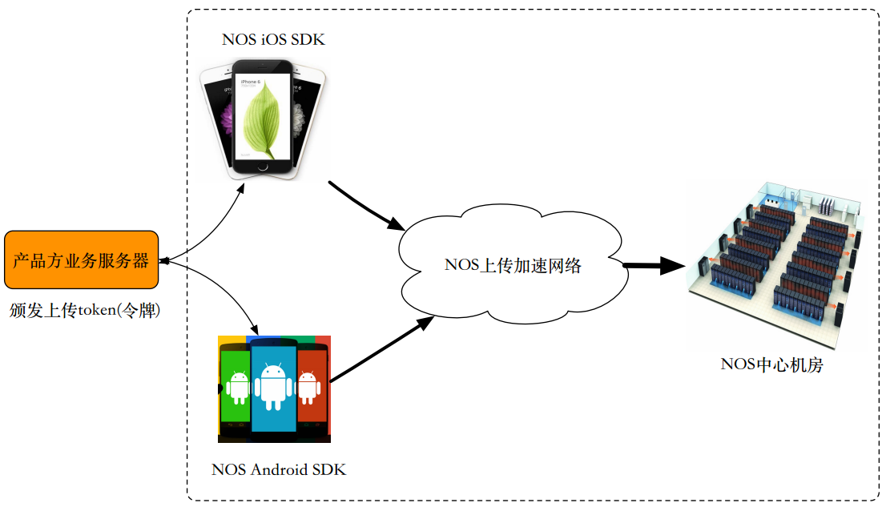
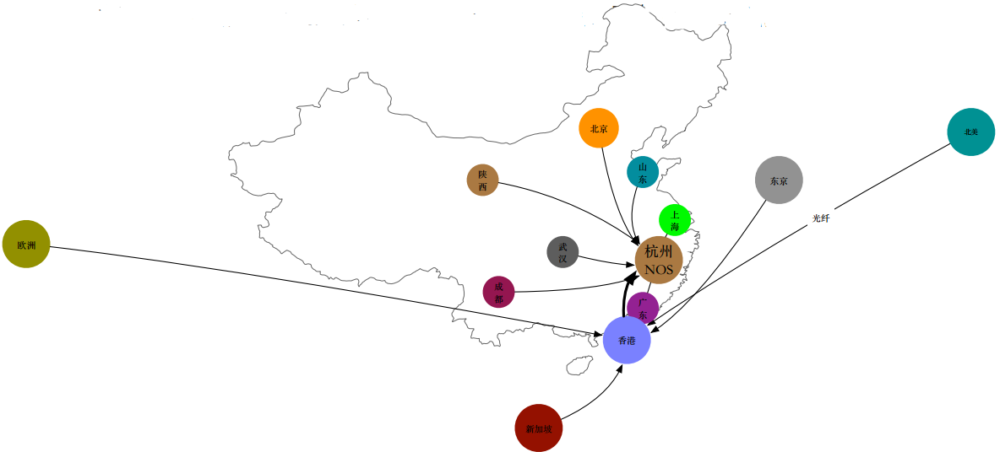
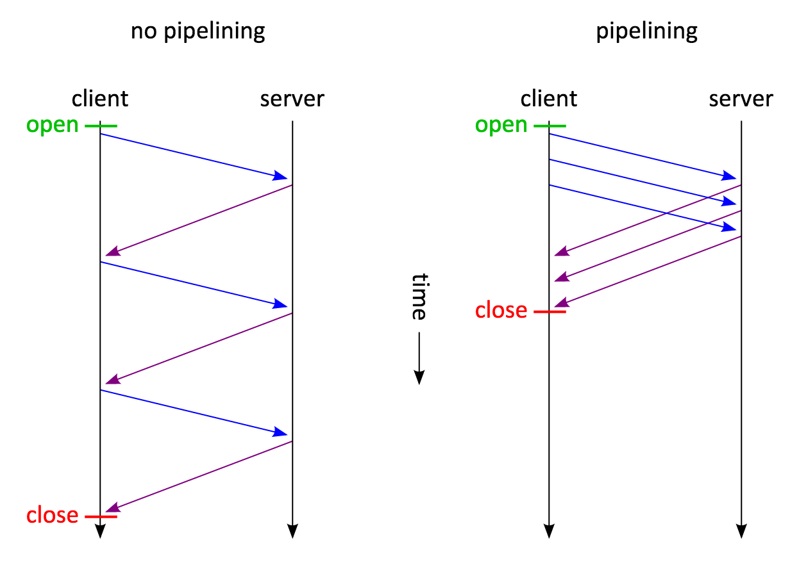

# 直传用户指南

## 直传简介

对于使用NOS服务的用户来说，上传必须的功能。而直传的主要目的是为了解决用户上传速度慢、接入成本高的问题。使用直传功能，用户可以将数据上传存储的问题都交给NOS，只需要关注自己具体的业务实现即可。并且直传采用了一系列的优化手段，相对于非直传来说，能够显著提高用户的上传速度。

## 背景
传统的上传方式为，用户在移动端或者Web端将文件上传到业务服务器，业务服务器再将数据上传到NOS。

该方案有以下几个缺点：

* 上传慢。从客户端将文件上传到业务服务器，再上传到NOS，上传路线长了一半。如果从客户端直接上传到NOS，传输距离近了一半，并且NOS在国内外部署了多个边缘节点，优化了边缘节点和中心机房的传输协议，速度更快。
* 扩展性差。由于用户的上传都要经过业务服务器，因此业务服务器既需要关注业务逻辑，也需要实现上传功能。随着用户数的增加，业务服务器很容易成为瓶颈，由于NOS采用的是云存储，可以认为处理能力是无限的。因此业务服务器随着用户数增加要不断扩容。增加了用户的负担。
* 安全性差。直传提供了对HTTPS和HTTP协议的双支持，安全性更高。
* 健壮性低。如果业务服务器出现问题，或者业务服务器所在网段出现问题，服务都会瘫痪。而直传提供了高可用方案，有多个机房，健壮性高。

由于考虑到传统的上传方式具有以上比较明显的缺点，因此提出了直传的解决方案。

## 直传架构

### 上传模型

* 客户端端向业务服务器请求上传Token(从安全角度考虑不建议将Token的生成放在移动端或者Web端)，具体的Token生成规则参考 [上传凭证]() 
* 客户端携带Token将数据发往直传网络
* 直传服务将数据发往NOS(直传服务器和NOS在同一个机房)

直传能做到上传速度更快、成功率更高，主要采用了以下几种手段：

* 布点，在国内外多个区域都有加速节点
* 协议优化
* pipeline上传

### 边缘节点

国内外多个区域都部署有边缘节点，客户端在上传的时候，会使用上传速度最快的边缘节点进行上传。NOS会在不同的地点以“国家+省份+城市+运营商”为维度统计到不同节点的上传速度，从而给用户提供最优的上传节点。上传到边缘节点后，边缘节点会通过优化的网络协议上传到直传服务器。

### 协议优化
NOS在上传协议方面做了很多优化。

#### 分片上传
NOS提供了分片上传接口，对于一个大文件，可以分成很多片进行上传（最大不超过10000片）。

#### 断点续传
NOS提供了断点续传功能。对于一个大文件，分片上传时如果有一片上传失败，不需要从头开始重新上传，使用NOS提供的上传上下文可以查询到断点信息，从断点处进行再次上传。并且NOS的断点信息采用持久化保存。

#### TCP优化
从TCP协议的滑动窗口、拥塞窗口等方面对TCP协议进行了针对性的调整，使其更符合直传的应用场景。

### pipeline上传
非pipeline的HTTP协议上传是串行上传，无法充分利用用户端的带宽。

从对比可以看出pipeline上传非一问一答式上传，能够连续发送多个HTTP请求，能够充分利用用户带宽。

### 回调方案
相对于传统的上传方式，客户端是直接和NOS进行数据流的传输。如果业务服务器需要感知客户端文件上传，进行业务上的统计等操作，NOS提供了事件通知功能。通过定制不同的规则，NOS会将不同的事件异步的通知给业务服务器。详细的介绍请参考 [事件通知](http://support.c.163.com/md.html#!平台服务/对象存储/对象存储事件通知.md)