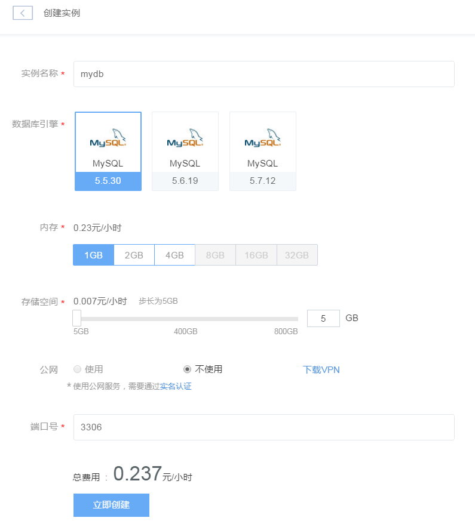
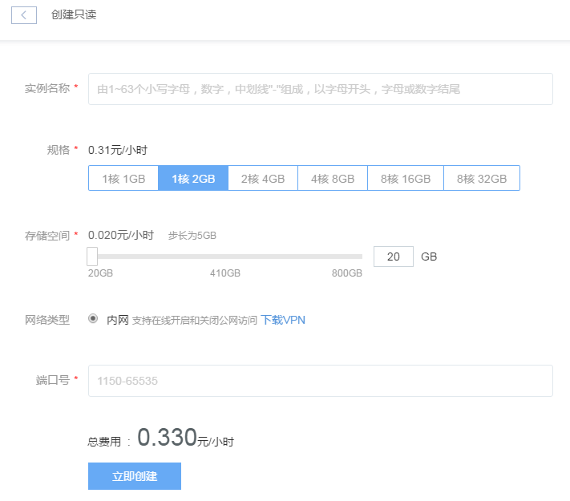
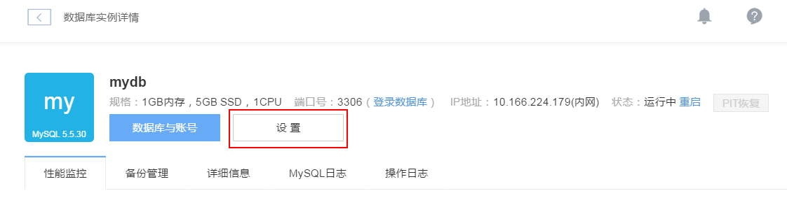

# 创建数据库实例

RDS 服务管理入口位于蜂巢首页的数据库服务选项。点击「数据库」，即可显示你的所有 RDS 实例列表，包括普通实例和只读实例。你可以在该界面进行实例创建、安全组管理等操作，此外还可以对具体实例进行设置、创建只读实例或提升只读实例角色（即提升只读实例为普通实例）等操作。如若需要进行数据库迁移，请参见如何导入数据库实例。

点击「实例名称」，即可进入实例详情界面，如下图所示：

## 创建实例
在数据库主界面，点击「创建实例」创建一个新的 RDS 实例。创建实例的界面如下图所示。首先填写实例名称、选择数据库引擎、实例规格和设置网络类型，然后点击「确认」按钮，开始创建实例。

**注**：默认不开启公网（你可以通过蜂巢 VPN 连接你的数据库实例），创建完成后可以再设置页面在线开启/关闭公网。

## 创建只读实例

数据库主界面显示了各个实例的概要信息。如果实例是一个高可用实例，则在实例的「操作」列会显示「创建只读」链接。点击「创建只读」，即可为实例创建一个只读实例，如下图所示：

只读实例的创建界面中，数据库引擎和源实例一致，不可更改，其余内容与创建实例相同。

## 提升只读实例角色

在数据库的主界面，点击实例名称右侧的箭头（如果存在），可以查看该实例的只读实例。对于只读实例，「操作」列提供了「提升角色」的功能，如下图所示。点击「提升角色」并确认，能够解除只读实例与源实例的关系，将只读实例变成一个普通的非高可用实例。

## 设置（修改）实例

某一指定实例的设置页面有两处入口：

1.在数据库的主界面，点击该实例在「操作」列的「设置」链接，如下图所示： 

2.在数据库的主界面，点击该实例的名称，进入该实例的「实例详情」页面，再点击「设置」按钮，如下图所示： 

设置实例页面提供了复制类型、备份类型、数据库参数和安全组等各项配置的修改操作，并可选择将修改设定为「立即生效」或「定时生效」。如果你选择定时生效，还需要选择「生效时间」。设置完成以后，点击「确认」即可。 

各项配置的详细说明如下：

### 复制类型

蜂巢提供同步和异步两种复制类型，推荐使用同步复制：如下图所示：

### 备份类型

你可以选择「增量备份」或「全量备份」。在选择了备份类型后，还可以对「备份周期」、「备份时间」等进行设置，如下图所示：

### 参数组

在参数组设置中，你可以修改数据库的配置。页面中只显示用户最常修改的参数，要查看和修改更多的参数，点击「更多设置」即可。

### 安全组

点击「修改安全组」可以为实例配置安全组，从而限制能够访问实例的主机，如下图所示：

在「设置实例」中，你只能新建或绑定已存在的安全组。若要对已存在的安全组进行修改，请参考 [管理安全组](http://support.c.163.com/md.html#!平台服务/数据库/使用指南/安全组管理.md)。设置实例页面同时提供实例删除功能，点击「删除实例」并确认，即可将实例删除。

