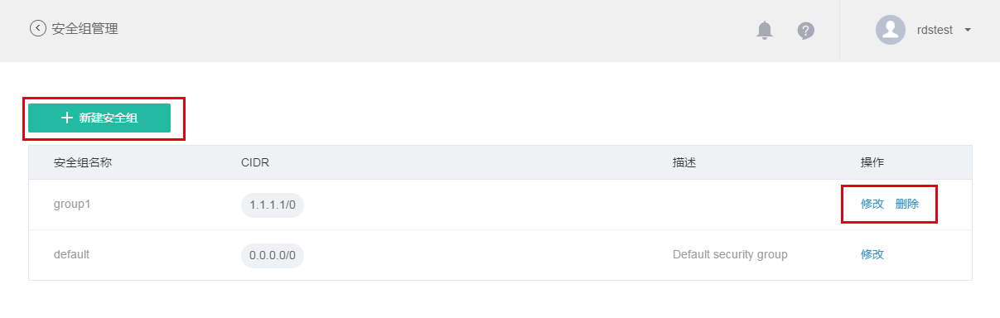
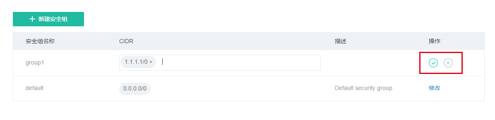

当你需要对 RDS 实例做更精确的网络隔离时，需要使用安全组功能。你可以通过设置实例的安全组，来保证只有特定的网络 IP 地址白名单能访问 RDS 实例，这样可以最大限度的保证用户数据库的网络安全性，如下面两图所示：

## 创建安全组

进入安全组管理页面之后，点击「新建安全组」按钮。显示如下页面： 

按提示输入安全组名称、CIDR（CIDR是一个形如xxx.xxx.xxx.xxx/xxx 的网络段）、安全组描述等三个信息。输入完成之后，点击「确认」，即可完成添加安全组。添加安全组之后，需要将实例和安全组的关系进行绑定，绑定后安全组方能生效。绑定实例和安全组，可在 [设置（修改）实例](#a) 时进行。

## 修改安全组

安全组修改功能允许你修改该安全组的白名单列表（即 CIDR）。进入到安全组管理页面之后，点击需要修改安全组的「修改」链接，即可对 CIDR 进行删除和添加操作。编辑完成后，请点击确认提交当前修改。 

## 删除安全组

在安全组管理页面，点击需要删除的安全组的「删除」链接，即可完成删除。 

 