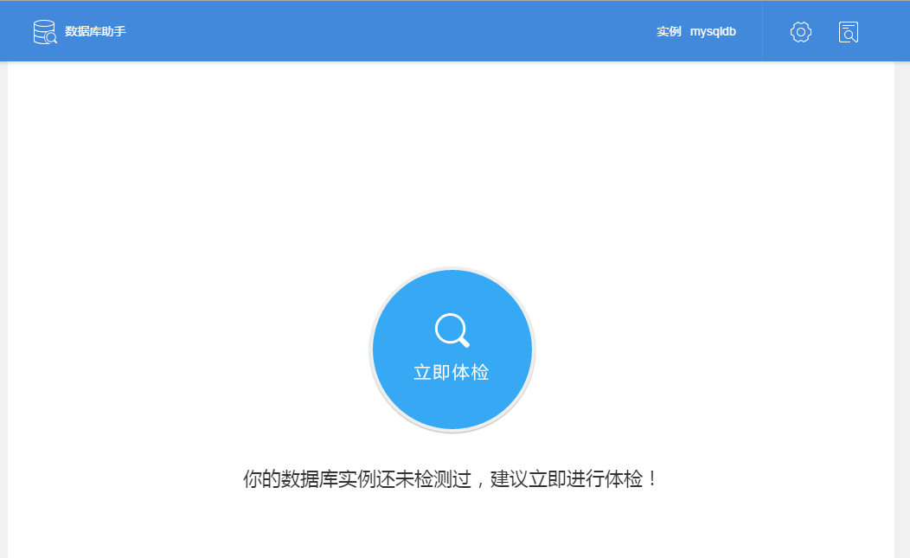
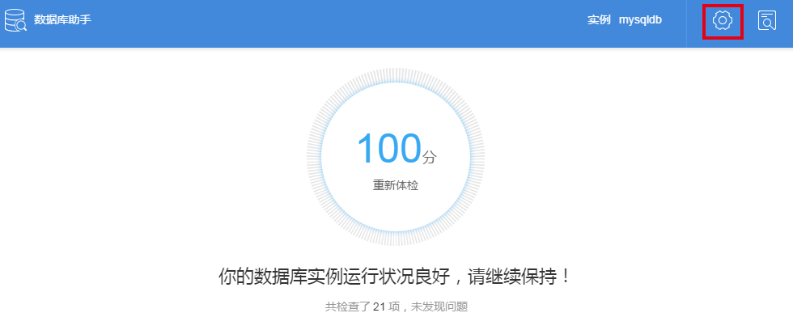

# 数据库服务助手
## 简介

数据库助手是蜂巢数据库服务的增值服务，为MySQL数据库实例提供专业的数据库管理和运维工具。

数据库助手的核心模块——数据库健康助手，旨在帮助你提前预知数据库运行风险，给出必要的改进方案和建议，将风险消灭在摇篮中，提升数据库服务质量。通过执行数据库健康检查，可获得直观的健康指数，快速判断当前数据库是否存在风险及其严重程度，并获取对应的修复建议。参考该建议，你可做出必要改进，消除风险，从而提升数据库稳定性。

数据库健康检查诊断内容包括容量规划、安全检查、主从复制、用户访问、参数检查、索引检查六大类， 细分为 21 个检查项。

数据库健康检查诊断内容包括容量规划、安全检查、主从复制、用户访问、参数检查、索引检查六大类， 细分为 21 个检查项。

|检查类别|	检查目的|	检查项|
|--------|----------|---------|
|容量规划|	检测当前资源是否成为瓶颈|	CPU、IO能力、网络带宽、存储空间、内存|
|安全检查|	检查服务是否存在安全隐患|	弱密码检查、定时体检、网络安全、权限检查|
|主从复制|	检查主从复制是否存在隐患|	复制性能、数据安全|
|用户访问|	检查用户访问是否正常|	死锁记录、慢日志统计|
|参数检查|	检查相关配置参数是否合理|	内存参数、重做日志、二进制日志、连接数配置|
|索引检查|	检测索引设计是否合理	|主键检查、无效索引、冗余索引、索引区分度|

若数据库健康指数未达到满分 100 分，我们建议：

* 不低于 60 分：数据库存在风险，建议修复；
* 60 分以下：数据库存在严重风险或数据库风险较多，强烈建议 立即修复。

## 健康检查

对于运行中的 MySQL 数据库实例，点击实例名称右侧的「健康检查」，进入数据库健康检查。

首次进入「数据库助手」， 系统提示「你的数据库实例还未检测过，建议立即进行体检！」。

点击「立即体检」，开始数据库健康检查。体检过程中，将实时显示当前得分、检查项名称、已检查项和待修复项数量。

体检完成后，系统给出数据库实例的最终得分、待修复项数量等。点击「查看详情」，可查看体检过程中各检查项的详细状态。

强烈建议：修复问题后，再次执行健康检查，以确保风险被消除。

查看健康检查详情

体检完成后，点击「查看详情」可查看健康检查结果：

所有待修复项以橙色图标显示，点击图标可查看该问题的详情和修复建议。

* 点击右侧「查看全部」，可查看所有待修复项问题的详情和修复建议。
 
另外，将根据检查类型在页面下方显示检查正常项，可点击右侧按钮展开查看。

设置自动健康检查

数据库健康助手还拥有自动健康检查功能。

点击右上角的「设置」按钮，勾选「每天自动检测」，设置期望执行健康检查的起止时间，并勾选所需检查的体检项。系统将在设定时间段内的业务空闲时间自动进行健康检查，你可随时登录系统查看检查结果。

注意：为保证数据库服务性能，建议选择业务较空闲的时间段进行健康检查。

