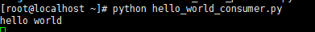

# 快速入门

本文通过 hello world 的示例描述消息队列的具体使用方法，开发语言为 python，版本 2.7。示例分为生产者和消费者，对应的文件分别为 hello_world_producer.py 和 hello_world_consumer.py。运行环境 Centos7.2。

## 创建消息队列实例

运行生产者和消费者之前需要新建一个消息队列的实例，本文中采用单实例的部署方式。
消息队列实例的具体新建方法参见文档[创建实例](http://support.c.163.com/md.html#!平台服务/消息队列/使用指南/创建消息队列实例.md)

## 编写生产者、消费者代码

由于生产者和消费者代码中需要用到 python 模块 pika，因此需要提前安装好此模块，可以使用 pip 直接安装，也可下载模块后进行安装。pip 安装方法如下:

    yum install python-pip -y
    pip install pika

之后书写生产者和消费者代码， 生产者文件 hello_world_producer.py 代码如下:

    #!/usr/bin/env python
    # -*- coding: UTF-8 -*-
    
    import pika
    import sys 
    
    #用户信息认证，需要填写用户自己的用户名和密码, 在[账户与密码]中可查看自己用户信息。
    credentials = pika.PlainCredentials("ngfMqVdU", "XT5QpNMMcDErG9JWQF2HC9vZwZGyMX1l")
    
    #此处IP地址需要填写用户自己的IP地址
    conn_params = pika.ConnectionParameters("59.111.97.60", credentials = credentials)
    
    #建立到服务器的连接
    conn_broker = pika.BlockingConnection(conn_params)
    
    #获得信道
    channel = conn_broker.channel()
    
    #声明交换器
    channel.exchange_declare(exchange="hello-exchange", type = "direct", passive=False, durable = True, auto_delete = False)
    
    msg = sys.argv[1]
    
    msg_props = pika.BasicProperties()
    
    #纯文本消息
    msg_props.content_type = "text/plain"
    
    #发布消息
    channel.basic_publish(body = msg, exchange = "hello-exchange", properties = msg_props, routing_key = "hola")

消费者文件 hello_world_consumer.py 代码如下:

    #!/user/bin/env python
    # -*- coding: UTF-8 -*- 
    
    import pika
    
    ##用户信息认证，需要填写用户自己的用户名和密码, 在[账户与密码]中可查看自己用户信息。
    credentials = pika.PlainCredentials("ngfMqVdU", "XT5QpNMMcDErG9JWQF2HC9vZwZGyMX1l")
    
    #此处IP地址需要填写用户自己的IP地址          
    conn_params = pika.ConnectionParameters("59.111.97.60", credentials = credentials)
    
    #建立到服务器的连接
    conn_broker = pika.BlockingConnection(conn_params)
    
    #获得信道
    channel = conn_broker.channel()
    
    #声明交换器
    channel.exchange_declare(exchange = "hello-exchange", type = "direct", passive = False, durable = True, auto_delete = False)
    
    #声明队列
    channel.queue_declare(queue = "hello-queue")
    
    #队列交换器绑定
    channel.queue_bind(queue = "hello-queue", exchange = "hello-exchange", routing_key = "hola")
    
    def msg_consumer(channel, method, header, body):
      "消息处理函数"
      #消息确认
      channel.basic_ack(delivery_tag = method.delivery_tag)
    
      if body == "quit":
        #停止消费并退出
        channel.basic_cancel(consumer_tag = "hello-consumer")
        channel.stop_consuming()
      else:
        print body
    
    #订阅
    channel.basic_consume(msg_consumer, queue = "hello-queue", consumer_tag = "hello-consumer")
    
    #消费
    channel.start_consuming()

## 运行代码

首先运行消费者:

    python hello_world_consumer.py

在另一个窗口中运行生产者，并发送消息 "hello world":

    python hello_world_producer.py "hello world"

此时消费者可以接收到消息 "hello world"， 如图:

生产者发送消息 "quit" 后消费者退出。