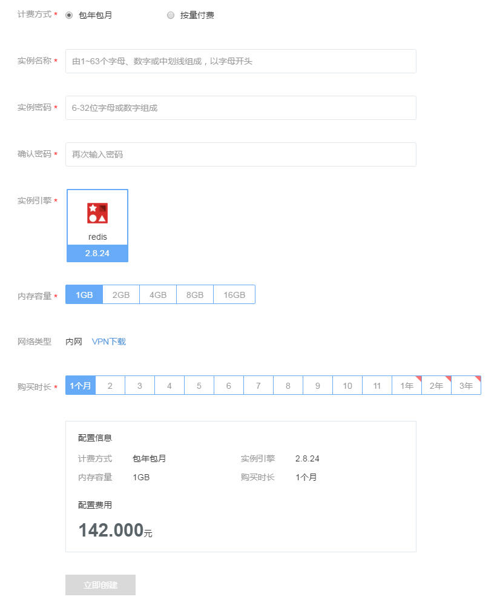
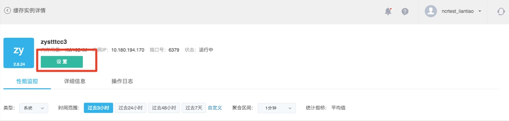
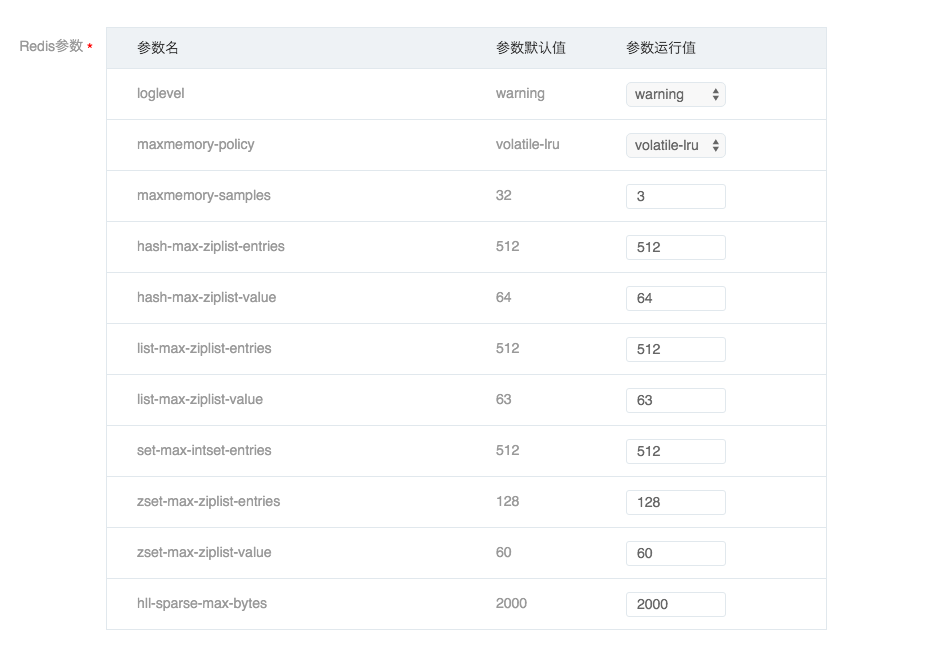

# 创建缓存实例

缓存服务管理入口位于网易蜂巢首页的缓存服务选项，点击「缓存服务」，显示当前用户的所有缓存实例列表。

你可以此创建实例，设置实例，查看实例状态等。点击实例名称，进入实例详情。

### **创建实例**

你可以在「缓存服务」主界面，点击「创建缓存实例」来创建一个新的缓存实例，创建实例界面如下所示，操作十分便捷，只需填写实例名称、实例密码，选择实例引擎和实例内存容量，然后点击「立即创建」按钮，即可开始创建实例。

实例创建时，我们采用了默认参数，你之后可以在「设置」中修改。

### **设置实例**

你可以在以下两处修改实例设置：

1.在「缓存服务」主界面，点击该实例「操作栏」的「设置」按钮；

2.在「缓存服务」主界面，点击该实例名称，进入「缓存实例详情」页面后，点击「设置」按钮。

在设置实例页面可以修改以下配置：

#### 内存容量

蜂巢提供在线修改内存容量，不停服即可完成内存容量修改，且不丢失缓存数据。

#### Redis 参数
修改实例配置的操作同样在线完成。

设置完成以后，点击「提交设置」即可。

设置实例页面同时提供实例删除功能，点击「删除实例」并确认，即可将实例删除。