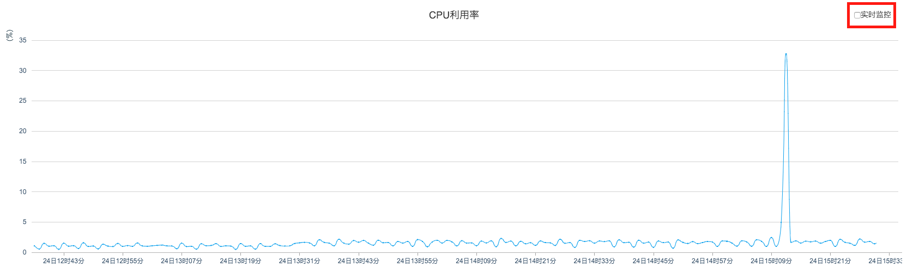
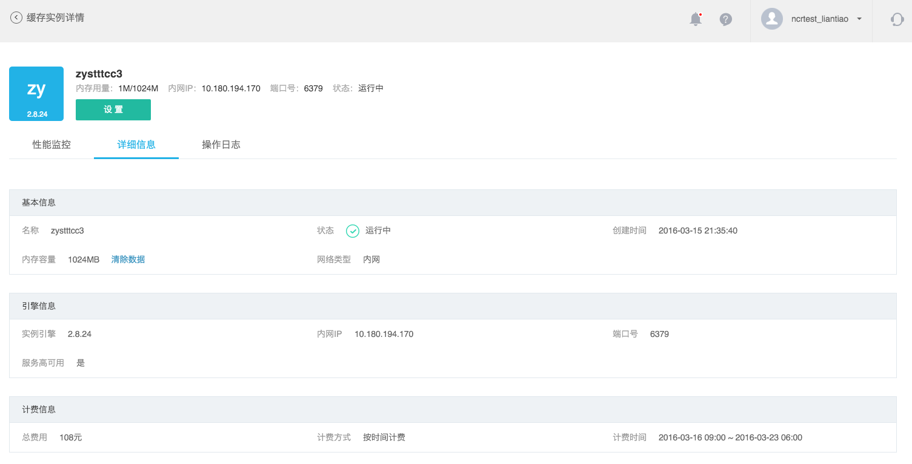
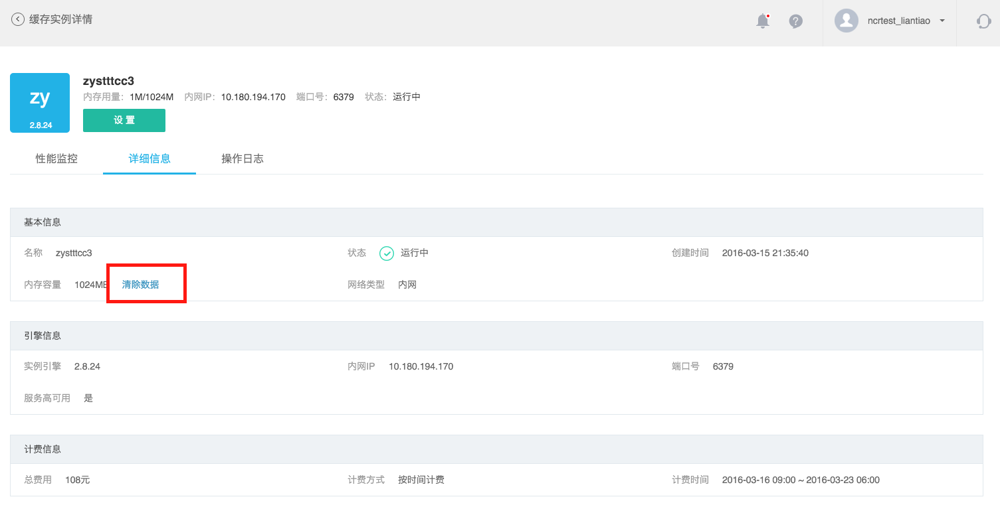
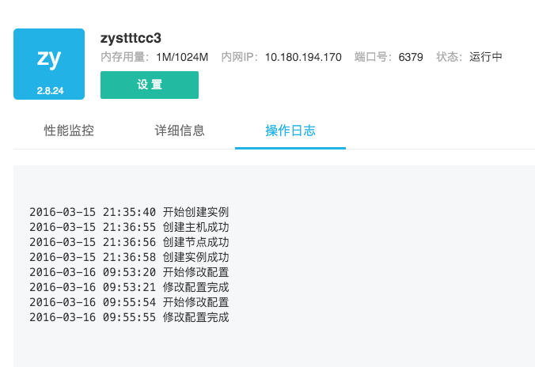

# 缓存实例管理

在「缓存服务」主界面，点击该实例名称，进入缓存实例详情页面。这里包含了「性能监控」、「详细信息」和「操作日志」功能，并提供「设置」按钮。

### **性能监控**

显示当前实例的系统和 Redis 的性能监控曲线。

#### 监控项
蜂巢提供以下 12 项监控数据的曲线图展示：  

|   **类型**  |                              **监控项**                                |     
|-------------|------------------------------------------------------------------------|
|系统         |	CPU 利用率、5 分钟系统平均负载、网络流出带宽、网络流入带宽             |
|Redis        | 客户端、内存利用率、操作数、命中率、全部 KEY 数量、超时 KEY 数量、每分钟惩罚 KEY 数量、每分钟过期 KEY 数量|

#### 时间范围与聚合区间
我们提供过去 3 小时、24 小时、48 小时和 7 天的时间范围快捷键，点击即可查看对应时段的监控数据;
同时支持自定义时间范围，点击「自定义」设定任意时间范围，查看对应时段的监控数据。

不同时间范围对应不同聚合区间供选择：

|   **时间范围**    |          **可选聚合区间**            |
|-------------------|--------------------------------------|
|时间范围＜3小时    |1分钟、5分钟、15分钟、1小时           |
|3小时≤时间范围＜1天|15分钟、1小时、6小时                  |
|1天≤时间范围＜2天  |1小时、6小时、1天                     |
|2天≤时间范围＜7天  |1小时、6小时、1天                     |
|7天≤时间范围       |6小时、1天                            |

#### 实时监控
若通过快捷键设定时间范围为「过去 3 小时」或「过去 24 小时」，我们提供实时监控功能。勾选/取消勾选 各性能监控数据曲线图右上角的「实时监控」，即可 开启/关闭 监控数据实时刷新。

#### 统计指标
缓存服务性能监控统计指标均以平均值作为统计指标。

#### 查看监控数据
在性能监控数据曲线图中，将鼠标移至数据节点，可查看该点的详细监控数据和聚合时间戳。

### **详细信息**

实例详情页面顶部展示实例名称、内存用量、网络地址、运行状态等信息。提供「设置」按钮修改实例信息。 点击「详细信息」标签，可以查看更多实例详情。

#### 清除数据
基本信息版块「内存容量」右方，提供「清除数据」功能，你可以通过该按钮清空实例内存。

### **操作日志**

在实例详情页面，点击「操作日志」标签，查看该实例的所有管理操作，包括配置修改、扩容等。

