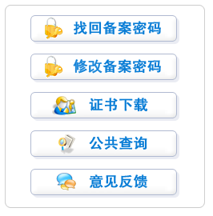
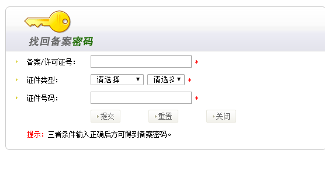
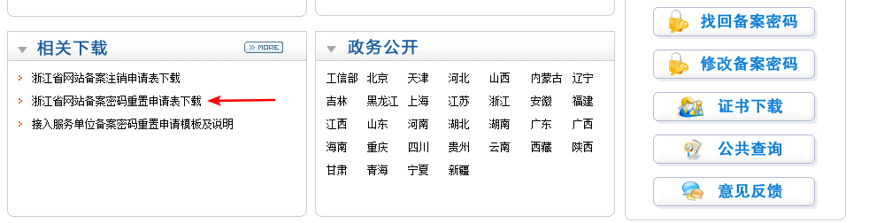

# 如何找回备案密码
备案密码找回方式分为两种：

1. 在线找回密码：登录备案号对应的管局网站，通过页面中的备案密码找回功能进行线上找回

2. 线下找回密码：下载管局备案密码找回申请表，表格中有填写要求及提供方式，填写完成后将此资料提交给管局进行找回

## 在线找回备案密码的操作
第一步：请您登录工信部系统：www.miitbeian.gov.cn，在页面下方“政务公开”选择备案号所在省份 

第二步：登录当地通信管理局页面后，点击右下方“找回备案密码”按钮。 

第三步：按要求填写备案时的主体备案号及证件号码。（备案/许可证号：填写您主体的备案号，无需填写后面的"-1"；证件类型：选择您之前备案的证件类型；证件号码：填写之前备案的证件号码） 第四步：备案密码会直接发送到您之前备案时的手机和邮箱中，请您查收 

## 线下找回备案密码的操作
如您之前备案的手机和邮箱已经无法正常使用，您可在当地通信管理局页面左下方“相关下载”处下载备案密码找回申请表，表格中有填表须知以及提交管局的方式，您下载表格后可自行查看 

