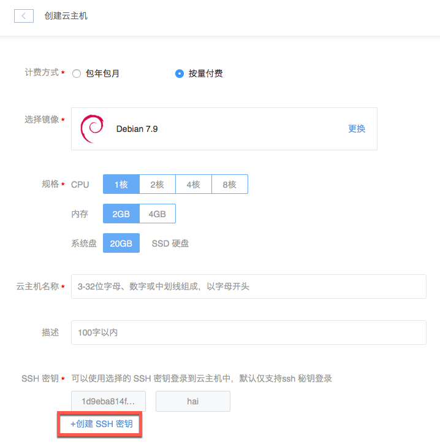
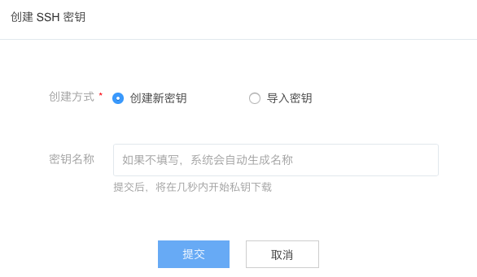

# 创建 SSH 密钥

Attention:
若由蜂巢为你生成密钥对，出于安全考虑，蜂巢只保存密钥对的公钥。创建密钥对时有且仅有这一次下载私钥的机会；
任何情况下，都请妥善保管私钥，没有私钥你将再也无法登录对应的实例。

Note:
支持由蜂巢为你创建 2048 位的 RSA 密钥对或导入公钥；
密钥对配额为 20，如需更多请提交工单。

## 操作步骤

你可以在 [SSH 密钥管理](https://c.163.com/dashboard#/m/sshkeys/) 处创建 SSH 密钥对；
也可以在 [创建云主机](../md.html#!计算服务/云主机/使用指南/实例/创建云主机.md)（若选择 Linux 系统镜像）时创建 SSH 密钥对：

### 创建新密钥

由蜂巢生成密钥对（2048 位的 RSA 密钥对），并在生成的首次直接下载私钥：

### 导入密钥

导入公钥内容或上传公钥文件：

