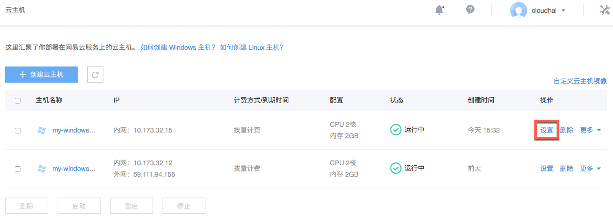
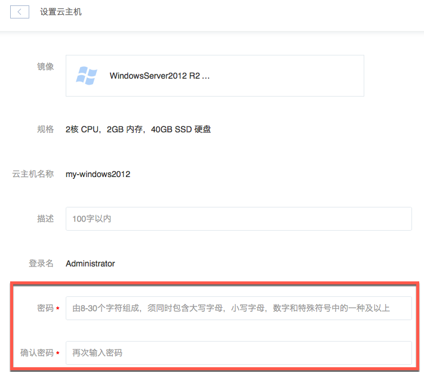

# 重置 Windows 密码

若遗忘 Windows 系统云主机密码，你可以重置设置实例密码。如需找回 VNC 密码，详见 [找回 VNC 密码](../md.html#!计算服务/云主机/使用指南/密钥和密码/找回VNC密码.md)。

## 操作步骤

1. 登录 [控制台](https://c.163.com/dashboard#/m/win/)，定位到目标实例；
2. 在右侧 「**操作**」 列中，点击「**设置**」按钮：

3. 在设置页面，重新设置开机密码：
