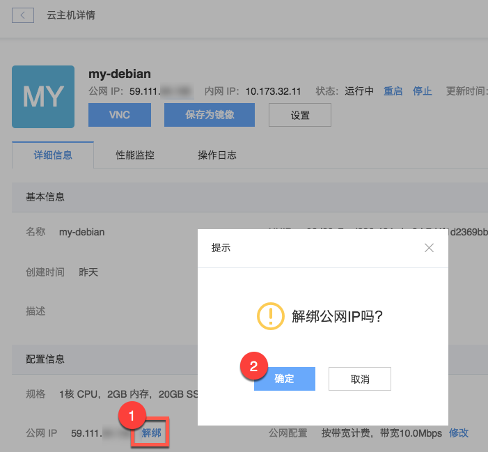

# 解绑公网 IP

Note:
解绑只是解除公网 IP 与该实例的关联并不会释放该公网 IP，如需释放请在 IP 管理内 [释放公网 IP](../md.html#!平台服务/IP 管理/使用指南/释放公网IP.md)。

## 操作步骤

1. 登录 [控制台](https://c.163.com/dashboard#/m/win/)，定位到目标云主机实例；
2. 点击实例名称，进入「**云主机详情页**」；
3. 在「**配置**」下，点击的「**解绑**」按钮；
4. 点击「**确定**」解绑公网 IP：

## 相关 API

[API 手册 - 解绑公网IP](../md.html#!计算服务/云主机/API 手册/云主机API/云主机API-解绑公网IP.md)