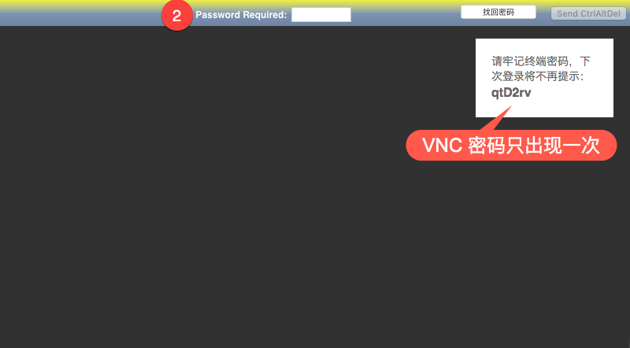
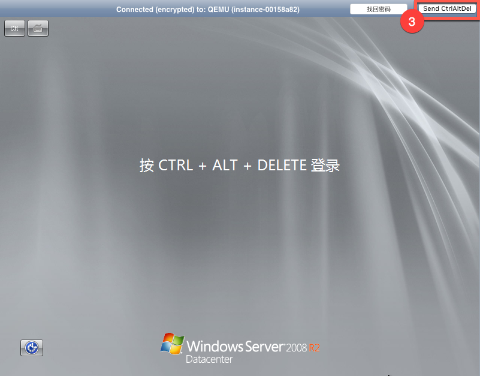

# 控制台 VNC 连接

VNC 方式登录云主机不依赖云主机本身的网络连通性，相当于云主机的显示器。

Note:
同一时间只有一个用户可以使用 VNC 登录；
关闭 VNC 窗口前请先退出云主机的登录状态；
建议使用 Chrome，Firefox，IE10 及以上版本浏览器；
暂不支持复制粘贴和文件上传下载。

Linux 系统说明：
* Linux 云主机默认只允许使用密钥对认证方式的 SSH 登录；
* 你可以在 SSH 登录云主机后，修改 root 密码，之后可以用此密码使用 VNC 方式登录云主机；
* 我们强烈建议你 **不要** 打开云主机的密码认证方式的 SSH 登录，否则你的云主机将极易被攻破；
* 如果你修改了 root 密码，请务必注意密码复杂度，并注意保存好修改后的密码。

## 使用场景

* 免去负载配置过程，直接操作云主机；
* Windows 系统蓝屏，使用 VNC 查看；
* 实例引导速度慢（如启动自检、修复模式等），使用 VNC 确认进度；
* CPU 满负载，带宽跑满导致无法远程连接，使用 VNC 结束异常进程；
* 实例错误设置导致无法软件远程连接（如开启防火墙等），使用 VNC 修改设置。

## 操作步骤

1. 登录 [控制台](https://c.163.com/dashboard#/m/win/)，定位到目标实例；
2. 点击实例名称，进入「**云主机详情页**」；
3. 点击「**VNC**」按钮，进入 VNC 页面：

4. 输入 VNC 密码（[找回 VNC 密码](../md.html#!计算服务/云主机/使用指南/连接实例/找回VNC密码.md)），按下回车键：

5. Windows 系统点击右上角的「**Send CtrlAltDel**」按钮，发送 Ctrl+Alt+Del 命令进入登录界面。

