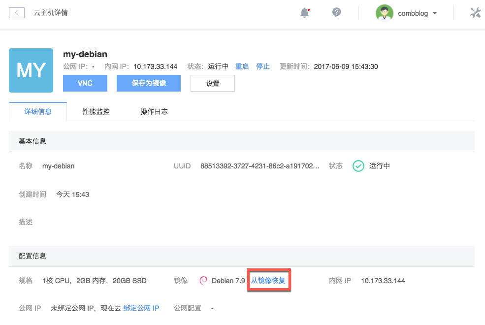
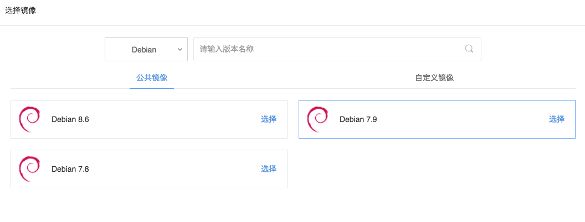

# 从镜像恢复

从镜像恢复即更换操作系统，可以使实例恢复至初始状态。

Attention:
该操作会将云主机原系统盘数据清空，请谨慎操作，如有必要建议先将系统盘 [保存为镜像](../md.html#!计算服务/云主机/使用指南/镜像/云主机-保存为镜像.md)。

Note:
暂不支持 Linux 和 Windows 系统的互换；
挂载的云硬盘不受影响，但恢复后需要重新 mount 或联机；
使用蜂巢提供的镜像恢复的云主机，系统密码将会初始化，需要重新设置；
使用用户自定义镜像恢复的云主机，系统密码与自定义镜像保持一致；
不会变更实例的 VNC 密码和公网 IP。

## 操作步骤

1. 登录 [控制台](https://c.163.com/dashboard#/m/win/)，定位到目标实例；
2. 点击实例名称，进入「**云主机详情页**」；
3. 在「**配置信息**」下，点击「**从镜像恢复**」按钮；
4. 确认清除数据并恢复：

5. 选择镜像： 
