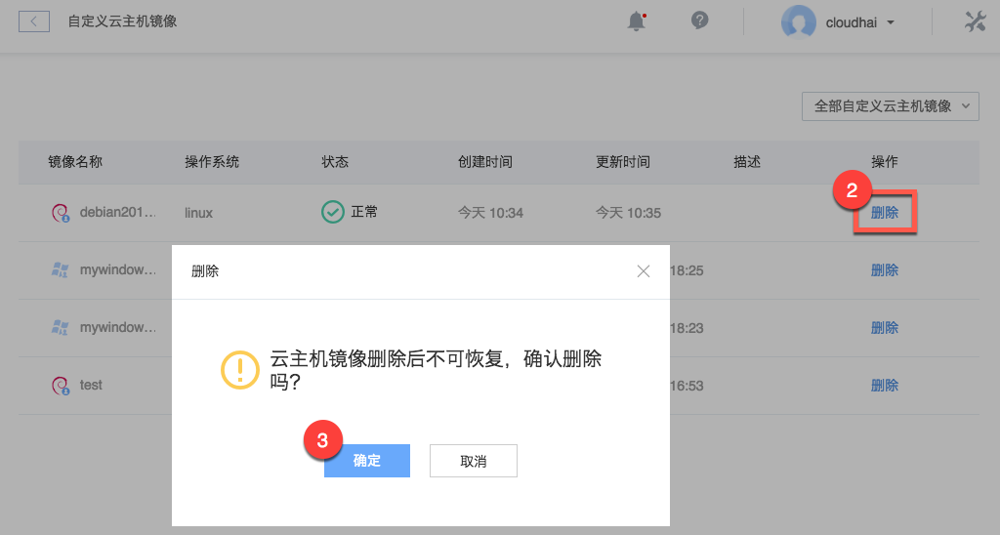

# 删除自定义镜像

Note:
自定义镜像删除后不可恢复；
不影响使用该镜像创建的实例。

## 操作步骤

1. 登录 [控制台](https://c.163.com/dashboard#/m/win/)，定位到「**云主机**」标签；
2. 点击右侧「**自定义云主机镜像**」按钮：

3. 在详情页定位到目标镜像，点击右侧操作列的「**删除**」按钮；
4. 确认删除：

## 相关 API

[API 手册 - 删除镜像](../md.html#!计算服务/云主机/API 手册/云主机API/云主机API-删除镜像.md)