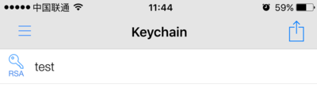
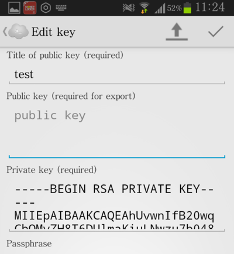
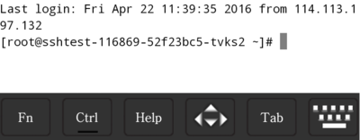

# 如何使用手机SSH客户端

## 简介
本文以 Server Auditor 客户端为例，分别介绍了 如何使用 iOS SSH 客户端 、 如何使用 Android SSH 客户端。示例所使用的容器详情如下图所示，密钥 test 为创建容器时新建的密钥。

Note:
SSH 登录是根据容器创建的公网地址 IP 进行连接，如果公网 IP 无法连接，则可以选择使用 VPN 连接的方式链接内网地址，具体操作详见 [如何使用 OpenVPN](http://support.c.163.com/wiki/md.html#!计算服务/容器服务/使用技巧/如何使用蜂巢 OpenVPN.md)。

## 如何使用 iOS SSH 客户端
1、在 App Store 搜索并安装「Server Auditor」软件：

2、打开软件，在主界面选择「Keychain」：

3、点击屏幕右上角的按钮，在弹出的条目中选择「New Key」导入密钥 test：

4、在创建有状态服务时，如果选择「创建新密钥」，则会自动下载密钥文件。你可以选择「导入密钥」，即将该本地密钥文件通过 iTunes 导入手机客户端；你也可以选择本地打开，复制粘贴密钥内容到手机客户端。若要查看密钥内容，操作步骤请参见 [如何使用 Web SSH Console](http://support.c.163.com/wiki/md.html#!计算服务/容器服务/使用技巧/如何使用 SSH 密钥登录.md)。 

5、点击「Save」，添加成功后，Keychain 列表会显示刚添加的密钥：

6、在主界面点击「Quick Connect」创建连接，填写内容如下图所示。其中 localhost 为创建容器时的公网 IP，端口默认为 22，点击右边的钥匙按钮，添加相应的密钥，最后点击「Connect」。

7、连接成功后，即可使用手机 SSH：

## 如何使用 Android SSH 客户端

1、下载 Server Auditor 安卓客户端，图标为灰色云朵。打开该软件后在主界面选择「Key Manager」导入密钥 test：

2、点击右上角按钮，你可以选择从手机导入密钥文件或直接复制粘贴密钥内容：

3、本文直接选择粘贴密钥内容，因此在「Private key」中进行粘贴。若要查看密钥内容，操作步骤请参见 [如何使用 Web SSH Console](http://support.c.163.com/wiki/md.html#!计算服务/容器服务/使用技巧/如何使用 SSH 密钥登录.md)；

4、密钥内容粘贴好后，点击右上角的对勾进行保存。成功添加后，列表中会显示该密钥：

5、回到主界面，选择「Quick Connect」连接 SSH。填写相应的内容，如下图所示。其中 localhost 为对应容器的公网 IP，端口默认为 22。然后点击钥匙按钮，添加密钥，最后点击「Connect」，确认对话框中点击「Yes」：

6、此时安卓手机客户端成功地登录了 SSH：

