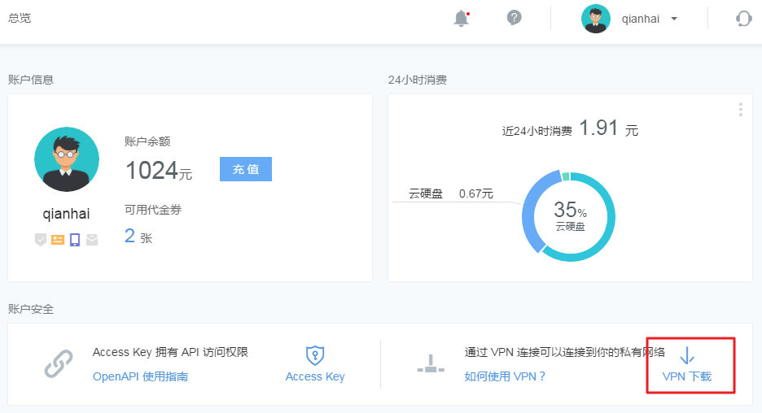
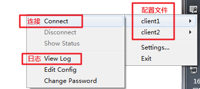

# 如何使用蜂巢 OpenVPN

## 简介

蜂巢部署了 OpenVPN 服务，并提供成品配置文件，直接使用即可连接到你的私有网络，以此轻松安全地访问你在蜂巢部署的各种服务。

OpenVPN 是一个功能齐全的 SSL VPN，它使用行业标准的 SSL/TLS 协议实现了 OSI 模型第二层（数据链路层）或第三层（网络层）的安全网络扩展。OpenVPN 支持基于证书、智能卡以及用户名/密码等多种形式的灵活的客户端认证方法，并可以通过应用于 VPN 虚拟接口的防火墙规则为指定用户或用户组设置访问控制策略。

本文将介绍如何安装 OpenVPN 并使用成品配置文件与你在蜂巢的各种服务建立专有连接。

## 配置文件下载

Attention:
同一时间只能连接一个 VPN；
配置文件默认有效期 6 个月，逾期重新下载配置文件即可，否则将无法连接蜂巢 VPN。

登录「控制台」，在「总览」页面右侧点击「VPN下载」：

## Windows 使用 OpenVPN

推荐使用 OpevnVPN 客户端：[下载地址](https://openvpn.net/index.php/open-source/downloads.html)。

1. 从 OpenVPN 官方网站 下载并安装最新版本客户端（安装时若遇到含义不清的选项，点击「Next」）；
2. 将下载的 VPN 配置文件放置在 OpenVPN 客户端 config 文件夹内。例如：OpenVPN 客户端安装路径为 D:\Program Files\OpenVPN，则将配置文件放置于 D:\Program Files\OpenVPN\config 内；
3. 右键点击桌面或开始菜单中的 OpenVPN GUI，选择「以管理员身份运行」，任务栏将出现 OpenVPN GUI 图标；
4. 右键单击任务栏内 OpenVPN GUI 图标，选择对应的 VPN 配置文件，点击「Connect」（仅有一份配置文件时，直接点击「Connect」）；
5. 当提示连接成功后，即可使用分配的私有网 IP 连接你在蜂巢的各种服务；
6. 连接失败请查看连接日志排错，注：配置文件有效期 6 个月。

## Mac 使用 OpenVPN

推荐使用 Tunnelblick：[下载地址](https://tunnelblick.net/downloads.html)

1. 从上述地址下载并安装最新版本客户端（dmg 文件直接安装即可）；
2. 将配置文件拖动至菜单栏的 Tunnelblick 图标上，或拖动至 VPN 详情窗口的配置分页里的配置列单上，来进行安装；
3. 在菜单栏点击 Tunnelblick 图标，选择对应 VPN 连接即可；
4. 当提示连接成功后，即可使用分配的私有网 IP 连接你在蜂巢的各种服务；
5. 连接失败请查看连接日志排错。

## Linux 使用 OpenVPN
以 Ubuntu 14.04 为例：

1.更新源：<pre>sudo apt-get update</pre>
2.Ubuntu 需使用 root 账号安装 OpenVPN：<pre>sudo apt-get install openvpn</pre>
3.切换至下载的配置文件所在目录，启动 OpenVPN：<pre>openvpn hello.ovpn</pre>
4.运行 <code>ip a</code> 命令，可以看到运行结果和添加的网络设备：

5.最后通过 ping 各服务提供的私有 IP，即可和使用本地的网络一样直接通过私有网进行数据传输和操作。