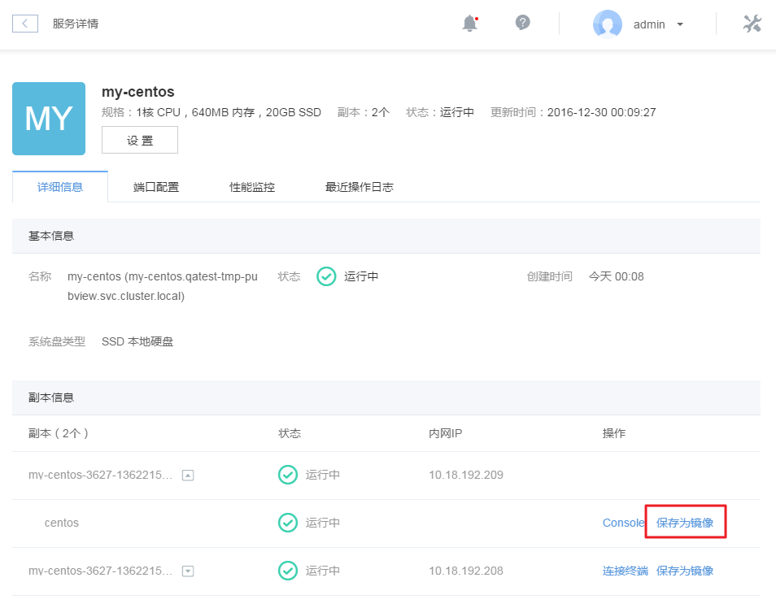
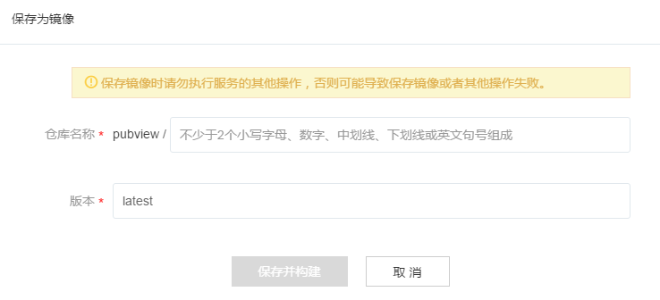

# 如何保存镜像

有状态和无状态服务均支持容器镜像保存。

Attention:
保存镜像时请勿执行服务的其他操作，否则可能导致保存镜像或者其他操作失败。

在容器服务页面，找到需要保存镜像的服务，点击该服务名称，进入「服务详情」页，在「副本信息」下方找到需要需要保存镜像的容器（无状态服务可能有多个副本和容器），点击「保存为镜像」。

在弹出的对话框内，输入镜像名称和版本，点击「保存并构建」即可。

