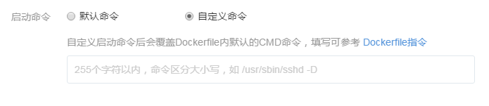

# 如何自定义服务启动命令

在 [服务创建](http://support.c.163.com/wiki/md.html#!计算服务/容器服务/使用指南/创建无状态服务.md) 页面可以设置自定义启动命令，自定义启动命令会覆盖 Dockerfile 内默认的 CMD 命令。

Attention:
若不了解原 Dockerfile/镜像的 CMD 和 ENTRYPOINT 内容，我们不建议修改自定义启动命令。

注意：

* 此处填写内容仅需输入 CMD 括号内内容，如命令 `CMD ["/usr/sbin/sshd","-D"]` 仅需填写 `/usr/sbin/sshd -D`
* 添加自定义命令前，建议先了解 Docker [CMD](https://docs.docker.com/engine/reference/builder/#cmd) 和 [ENTRYPOINT](https://docs.docker.com/engine/reference/builder/#entrypoint) 命令；
* 自定义命令不支持覆盖 ENTRYPOINT，鉴于此点如需添加自定义命令须了解原镜像的 CMD 和 ENTRYPOINT 内容；
* 请正确填写自定义命令，错误的自定义命令将导致服务创建失败。

## 自定义命令规则
自定义命令相当于 kubernetes 的 [Args](http://kubernetes.io/docs/user-guide/containers/#containers-and-commands)，可以覆盖 CMD，但不会覆盖 ENTRYPOINT。规则举例如下：

| Image Entrypoint |  Image Cmd   |  自定义命令  |    最终结果    |
|------------------|--------------|--------------|----------------|
| [/ep-1]          | `<not set> ` | `<not set> ` | [ep-1]         |
| [/ep-1]          | `<not set> ` | [zoo boo]    | [ep-1 zoo bar] |
| [/ep-1]          | [foo bar]    | `<not set>`  | [ep-1 foo bar] |
| [/ep-1]          | [foo bar]    | [zoo boo]    | [ep-1 zoo boo] |
| `<not set> `     | [/ep-2]      | `<not set>`  | [ep-2]         |
| `<not set> `     | [/ep-2]      | [/ep-3]      | [ep-3]         |
| `<not set> `     | `<not set>`  | [/ep-3]      | [ep-3]         |

