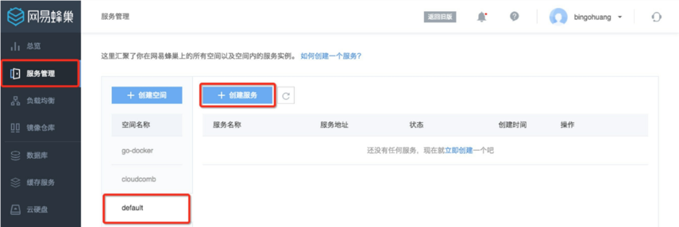
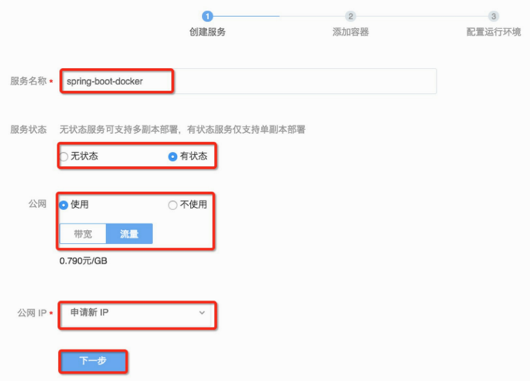
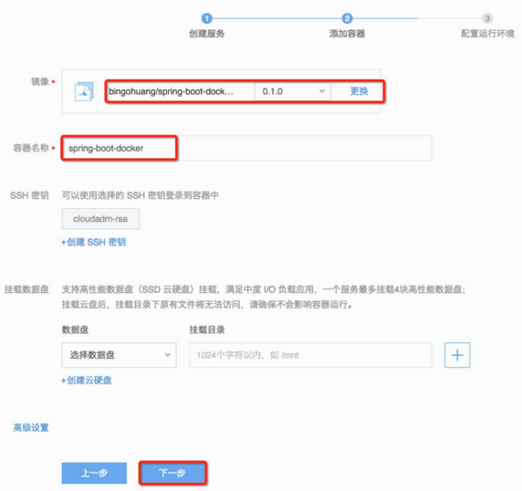
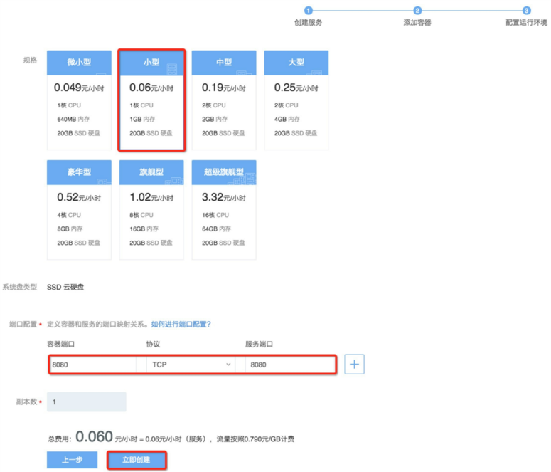
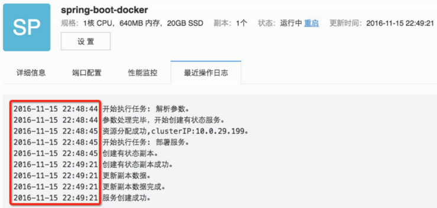
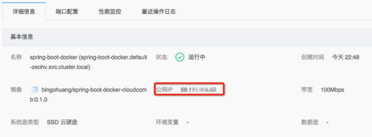

# 在网易云上创建服务

打开网易云控制台：https://c.163.com/dashboard ，点击左侧菜单栏服务管理，可以使用默认空间，点击“创建服务”，如下图所示。

创建服务总共分三步，可进可退。

第一步：设置服务名、服务状态、公网IP及计费模式设置，再点击“下一步”，如下图所示。

第二步：选择镜像，设置容器名称即可，SSH秘钥用于远程登录，对于一个服务来说，可以不选，点击“下一步”，如图2-7所示。

第三步：选择规格，默认SSD云硬盘，配置容器到服务的端口映射（对有状态的服务，默认对外暴露的还是容器端口），副本数限制为1，不到5分钱一个小时，点击“立即创建”，如下图所示。

不到1分钟时间，服务创建成功，如下图所示。

再点击详细信息，查看基本信息中的公网IP，此服务是59.xxx.xxx.xx。如下图所示。

打开浏览器，访问服务 http://59.xxx.xxx.xxx:8080/ ，输出结果如下图所示。

