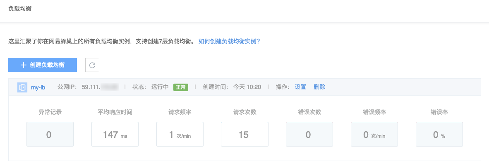
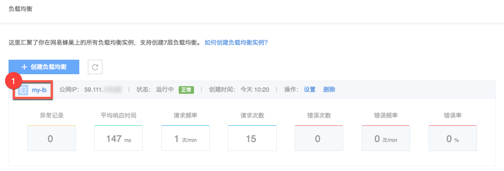
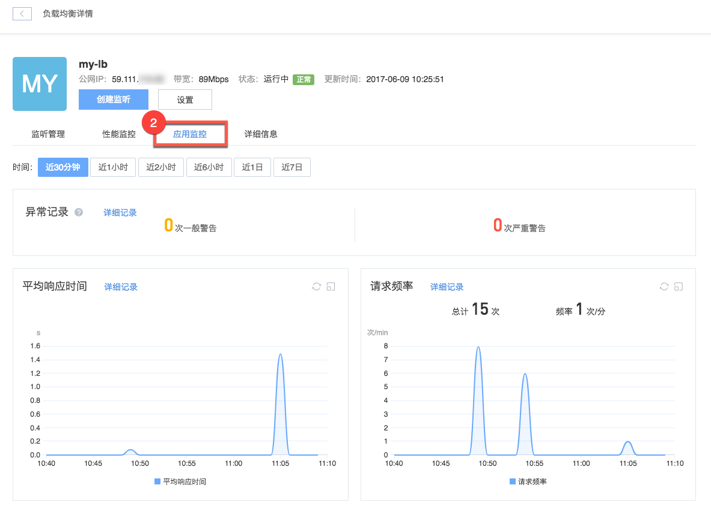

# 应用监控

应用监控通过探针的方式，分布式地采集服务运行数据，汇总到监控服务器。监控服务器记录、整理、分析性能数据，最后产生监控图表，展示给用户查看。

## Dashboard

你可以在 [负载均衡](https://c.163.com/dashboard#/m/ingress/) 列表页，查看到各实例的 Dashboard：

通过负载均衡列表仪表盘，你可以看到 30 分钟内的性能数据指标，这些指标包括：

* 异常记录：超出规定指标的数据将被记录到健康异常中；
* 平均响应时间：入口请求在观察周期内的平均响应时间；
* 请求频率、请求次数：入口请求在观察周期内的请求次数和频率（按分钟计）；
* 错误频率、错误次数、错误率：入口请求在观察周期内的错误次数和频率（按分钟计），以及错误次数与请求次数的比例。

## 应用监控

1. 登录 [控制台](https://c.163.com/dashboard#/m/ingress/)，定位目标实例，点击「**实例名称**」：

2. 在负载均衡详情页，点击「**应用监控**」标签：

通过该图表，你可以快速判断系统是否出问题，以及问题的大致类型是什么。

## 监控明细

蜂巢还提供了丰富的明细图表和快照信息，帮助用你速定位问题。入口：

* 点击 Dashboard 异常记录、错误次数、错误频率、错误率的具体数值
* 或点击应用监控图标的详细记录

在此，你可以查看到：

* 每个访问的请求，具体的统计信息。
* 慢的请求、出错的请求、以及健康异常事件的记录。

