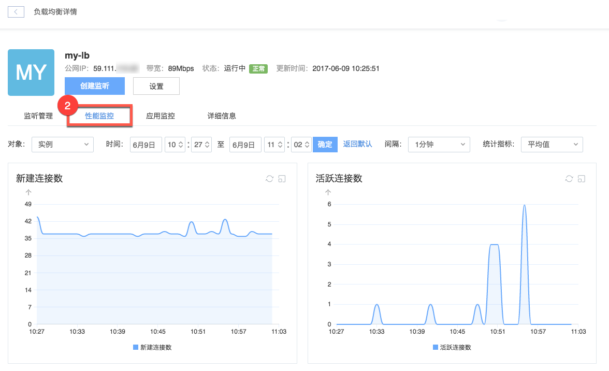

# 性能监控

性能监控页面展示了实例或监听级别的四种性能数据，提供三项统计指标供选择，并基于用户指定的时间范围，提供不同聚合区间的监控功能。 

## 使用场景

监控连接数和流量，以便按需提升实例带宽。

## 操作步骤

1. 登录 [控制台](https://c.163.com/dashboard#/m/ingress/)，定位目标实例，点击「**实例名称**」：

2. 在负载均衡详情页，点击「**性能监控**」标签：

### 监控项

* 实例级别
	* 新建连接数
	* 活跃连接数
	* 网络流入带宽
	* 网络流出带宽
* 监听级别
	* 新建连接数
	* 活跃连接数

### 时间范围与聚合区间

提供过去 3 小时、24 小时、48 小时和 7 天等时间范围快捷按钮，点击即可查看相应时间范围内的监控数据。
支持自定义时间范围，点击「自定义」，即可设定任意时间范围查看相应时段的监控数据。
根据时间范围大小，系统提供不同聚合区间供选择，具体对应如下表：

|         时间范围        |       可选聚合区间      |
|-------------------------|-------------------------|
| 时间范围 ＜ 1 天        | 1 分钟、5 分钟、15 分钟 |
| 1 天 ≤ 时间范围 ＜ 2 天 | 15 分钟、1 小时、6 小时 |
| 2 天 ≤ 时间范围 ＜ 7 天 | 1 小时、6 小时、1 天    |
| 7 天 ≤ 时间范围         | 1 小时、6 小时、1 天    |

### 统计指标

系统提供三种性能监控统计指标：最大值、最小值、平均值。点击统计指标选择框可调整监控数据的统计指标。

