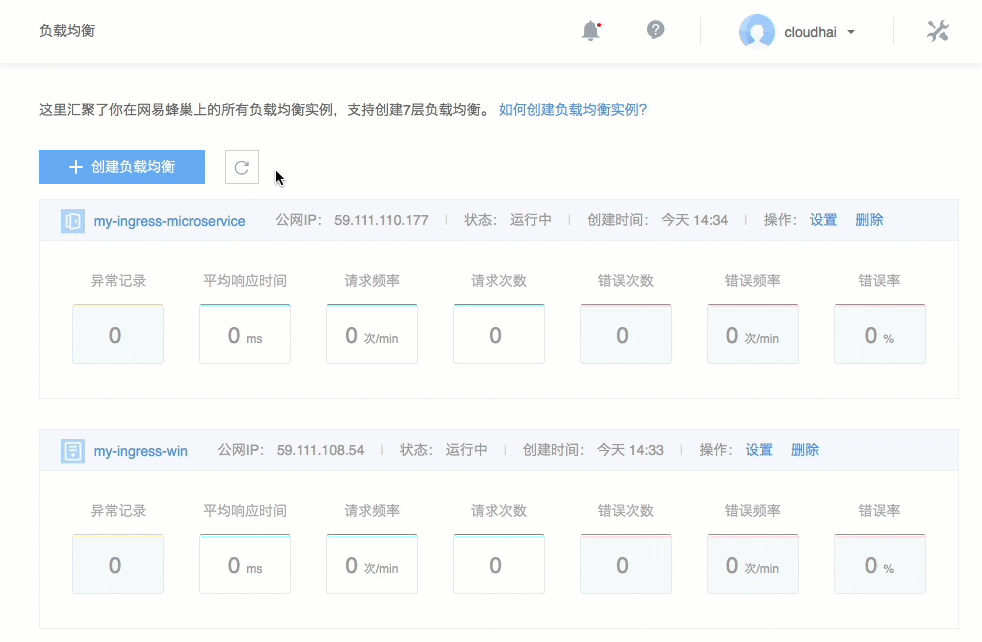

# 创建监听（面向服务）

Note:
面向服务的负载均衡添加监听器；
默认单个实例监听上限为 20 组，如果需要更多监听，请 [提交工单申请](https://c.163.com/dashboard#/m/ticket/)。

## 1. 创建监听

1.1. 登录 [控制台](https://c.163.com/dashboard#/m/ingress/)，定位到目标实例；

1.2. 点击实例名称，进入负载均衡详情页；

1.3. 点击「**创建监听**」按钮：

## 2. 配置监听

### 2.1. 监听协议
目前支持 HTTP 、HTTPS 和 TCP 协议，使用 HTTPS 协议。需在下方 添加 SSL 证书。

* 你可以在蜂巢申请免费的 DV 证书用户实现 HTTPS，详见：[如何申请 SSL 证书](http://support.c.163.com/md.html#!平台服务/SSL证书管理/使用指南/申请SSL证书.md)
* 也可以添加本地 SSL 证书

### 2.2. 监听端口
* HTTP 使用 80 或 1025 - 65535 内数字
* HTTPS 使用 443 或 1025 - 65535 内数字
* TCP 使用 20 - 65535 内数字

### 2.3. 转发规则

#### 2.3.1. 默认规则
默认转发所有请求。

* 后端服务：创建负载均衡时选择的空间内的后端服务。
	* 服务端口：后端服务 **必须** 添加该端口配置，详见 [常见问题 Q1](http://support.c.163.com/md.html#!计算服务/负载均衡/常见问题/负载均衡常见问题.md)
	* 健康检查：详见 [配置健康检查](http://support.c.163.com/md.html#!计算服务/负载均衡/运维指南/配置负载均衡健康检查.md)
* 会话保持：可以选择「不启用」或「启用」，默认为「不启用」。启用会话保持可以「植入 Cookie」或「改写 Cookie」：
	* 植入 Cookie：负载均衡服务自动生成 Cookie，可以指定超时时间，单位为 S 默认 30 秒；
	* 改写 Cookie：改写用户指定的 Cookie，如果没有对应 Cookie 则不使用会话保持。

#### 2.3.2. 定制规则

Attention:
目前使用定制规则，请先添加一条域名为 * URL为 / 的前置通配规则。

* 域名
	* 每组监听可以设置多个域名，域名支持完整域名和通配符
	* 长度最大 512 个字符
	* 可添加多个，由空格分隔, 如 `a.com b.com c.com`
	* 其中每一项包含字符必须是：数字，字母，`_`（下划线），`-` (横线)，`.`（点）或者通配符（`*.` 或`.*`）
	* 通配符 `*.` 必须在开头，`.*` 必须在结尾
	* 以 c.163.com 为例，格式如下所示：
		* c.163.com 精确匹配 c.163.com 域名
		* *.163.com 匹配所有以 163.com 结尾的域名
		* c.163.* 匹配所有以 c.163 开始的域名

Attention:
如果开启了域名匹配，但请求的域名匹配不到任意一条规则，将返回 403。

* URL 配置
	* 长度最大 128 个字符
	* 可添加多个url，由空格分隔, 如 `/a /b /c`
	* URL 必须以 `/` 开头
	* 除 `/` 外，包含字符必须是字母，数字
	* 不能以 `/` 结尾
	* 可支持多级 URL，如 `/news/social`
	* 使用前缀匹配，支持 `/`，可以在最后加入 `$` 来做完整匹配
	* 健康检查：详见 [配置健康检查](http://support.c.163.com/md.html#!计算服务/负载均衡/运维指南/配置负载均衡健康检查.md)

#### 2.4. 高级设置

默认附加 HTTP 头：

* **客户端真实 IP**：通过 X-Forwarded-For 头字段获取客户端真实 IP；
* **负载均衡监听协议**：通过 X-Forwarded-Proto 头字段获取客户端真实 IP；
* **负载均衡实例入口 IP**：通过 NLB-VIP 头字段获取负载均衡实例公网 IP 地址。

后端实现方式请参考：[获取真实 IP（Linux）](http://support.c.163.com/md.html#!计算服务/负载均衡/运维指南/获取真实IP-Linux.md)。

## 相关 API

[API 手册 - 创建监听](http://support.c.163.com/md.html#!计算服务/负载均衡/API 手册/创建监听.md)

