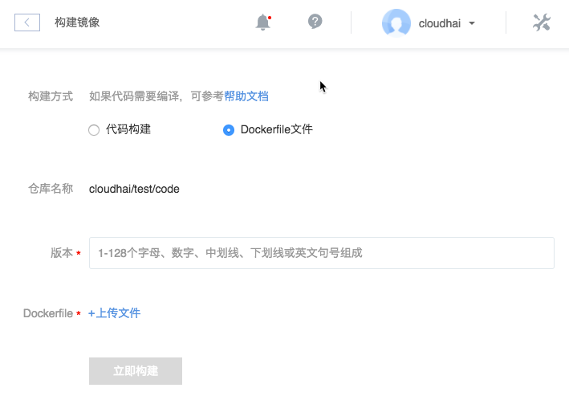

# Dockerfile 构建镜像

Note:
若没有镜像仓库，请先 [创建镜像仓库](http://support.c.163.com/md.html#!计算服务/镜像仓库/使用指南/创建镜像仓库.md)。

## 操作步骤

1. 登录 [控制台](https://c.163.com/dashboard#/m/mirrorRepo/)，定位「**镜像仓库**」标签；
2. 定位并进入需要构建镜像的镜像仓库；
3. 在「**镜像仓库详情**」页，点击「**构建镜像**」按钮（如 Java 之类的代码如需要编译，请参考：[如何在构建镜像时编译代码](http://support.c.163.com/md.html#!计算服务/镜像仓库/使用技巧/如何在构建镜像时编译代码.md)）：

4. 构建方式选择「**Dockerfile文件**」：

5. 设定版本，即镜像 tag；
6. 上传本地 Dockefile 文件；
7. 确认信息，点击「立即构建」按钮，开始构建镜像。

Attention:
每个镜像仓库目前支持构建 100 个镜像，超过时将不能进行构建。

