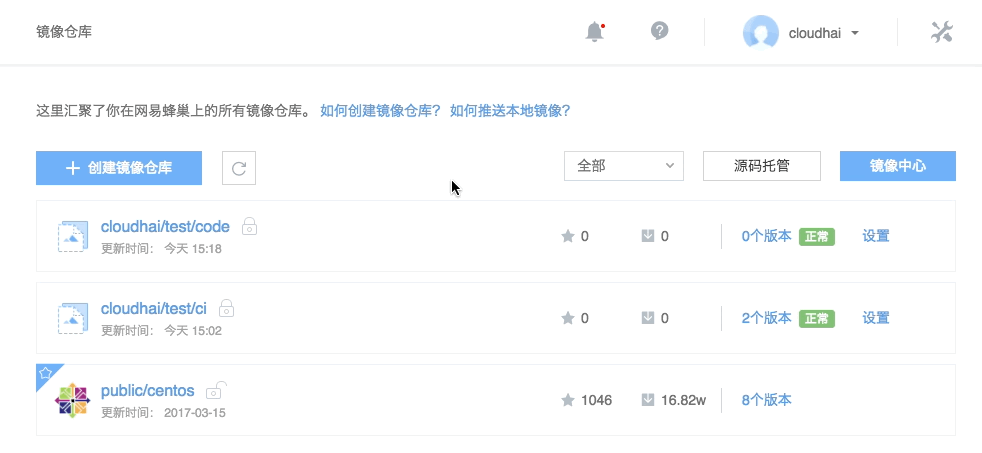

# 代码构建

Note:
1. 若没有镜像仓库，请先 [创建镜像仓库](http://support.c.163.com/md.html#!计算服务/镜像仓库/使用指南/创建镜像仓库.md)； 2. 创建镜像仓库时，持续集成请选择不支持。

## 操作步骤

1. 登录 [控制台](https://c.163.com/dashboard#/m/mirrorRepo/)，定位「**镜像仓库**」标签；
2. 定位并进入需要构建镜像的镜像仓库（需 **不支持持续集成**）；
3. 在「**镜像仓库详情**」页，点击「**构建镜像**」按钮：

4. 构建方式选择「**代码构建**」（如 Java 之类的代码如需要编译，请参考：[如何在构建镜像时编译代码](http://support.c.163.com/md.html#!计算服务/镜像仓库/使用技巧/如何在构建镜像时编译代码.md)）：

5. 设定版本，即镜像 tag；
6. 源码管理：
子目录为应用运行所在目录，默认为当前目录；
我们提供了示例代码，详见：[实例代码](http://support.c.163.com/md.html#!计算服务/镜像仓库/使用技巧/项目示例.md)。
7. 选择 Dockerfile：
**自定义 Dockerfile**（推荐）：需指定 Dockerfile 文件在代码源中的绝对路径，详见：[如何填写自定义 Dockerfile](http://support.c.163.com/md.html#!计算服务/镜像仓库/使用技巧/自定义Dockerfile填写方法.md)；
**默认 Dockerfile**：使用蜂巢默认 Dockerfile 需遵循一定的规则，详见：[默认 Dockerfile 说明](http://support.c.163.com/md.html#!计算服务/镜像仓库/使用技巧/默认 Dockerfile.md)。
8. 确认信息，点击「立即构建」按钮，开始构建镜像。

Attention:
每个镜像仓库目前支持构建 100 个镜像，超过时将不能进行构建。
