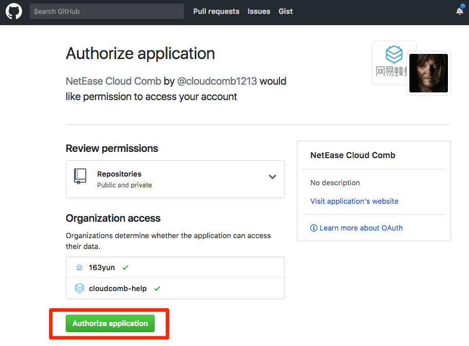

# 关联账号

Note:
源码托管用于镜像的持续集成，详见 [代码构建镜像（持续集成）](http://support.c.163.com/md.html#!容器服务/镜像仓库/使用指南/构建镜像/代码构建镜像-持续集成.md)。

1. 登录 [控制台](https://c.163.com/dashboard#/m/mirrorRepo/)，定位「**镜像仓库**」标签；
2. 在镜像仓库列表右上角，点击「**源码托管**」按钮：

3. 定位到代码托管仓库（目前支持 GitHub），点击右侧的「**关联账号**」按钮：

4. 登录代码托管仓库，授权应用程序：
