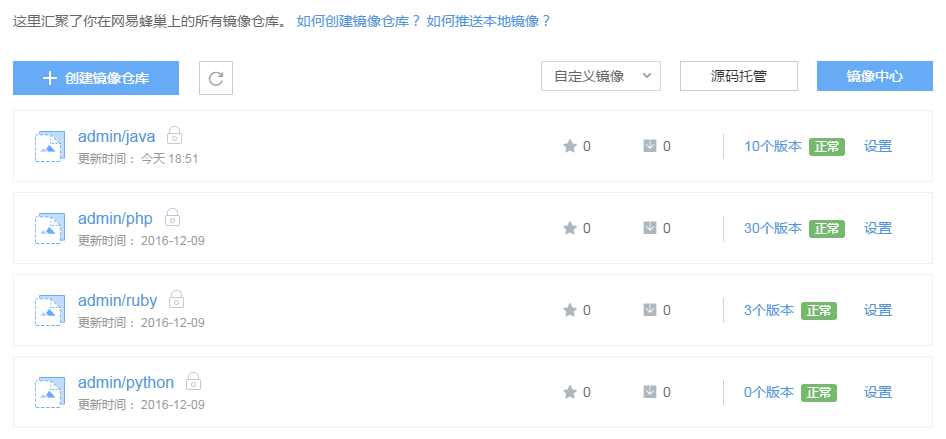
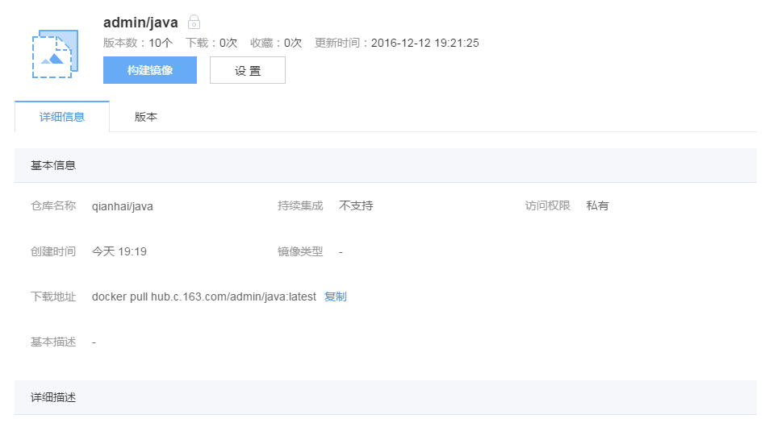

# 私有镜像中心

私有镜像中心是用户私人镜像仓库的管理中心，管理以下两类镜像仓库：

* 自定义镜像的镜像仓库：用户有完整操作权限的镜像仓库，镜像来源如下：
	* 代码构建自定义镜像（持续集成）
	* 代码构建自定义镜像
	* Dockerfile 构建自定义镜像
	* Docker 客户端构建自定义镜像
	* 服务内容器保存为的自定义镜像
* 收藏镜像的镜像仓库：从 [蜂巢镜像中心](https://c.163.com/hub#/m/home/) 收藏的官方、第三方公开镜像（[如何收藏镜像](http://support.c.163.com/wiki/md.html#!容器服务/镜像仓库/使用指南/收藏镜像.md)）。

## 镜像中心层级结构

蜂巢私有镜像中心的层级结构如下图所示：

* 一个镜像仓库包含多个版本；
* 当镜像仓库中不包含任何镜像的版本时，该镜像仓库为空。
每一层都支持各种操作，例如：

	* 私有镜像中心层：支持创建镜像仓库、列出所有镜像仓库等；
	* 镜像仓库层：支持通过 Dockerfile 构建新镜像、设置镜像仓库的访问控制权限等；
	* 版本层：支持删除一个特定的版本等。

## 私有镜像中心主页面

登录蜂巢控制台，点击左侧导航菜单的「镜像仓库」，进入私有镜像中心：

你可以在「镜像仓库」主界面查进行如下操作：

* 点击「创建镜像仓库」创建新的镜像仓库；
* 查看镜像仓库基本信息，如镜像仓库名、更新时间、镜像仓库包含版本数、状态等；
* 点击「镜像仓库设置」修改镜像仓库的各种属性；
* 通过切换标签，显示在镜像中心收藏的镜像（[如何收藏镜像](http://support.c.163.com/md.html#!容器服务/镜像仓库/使用指南/收藏镜像.md)）；
* 源码托管（目前持续持续集成仅支持 Github）。

## 创建镜像

蜂巢支持用户使用自定义镜像，你可以通过以下方式创建自定义镜像：

* 代码构建自定义镜像（持续集成）
* 代码构建自定义镜像
* Dockerfile 构建自定义镜像
* Docker 客户端构建自定义镜像
* 服务内容器保存为的自定义镜像

详见：[创建自定义镜像](http://support.c.163.com/md.html#!容器服务/镜像仓库/使用指南/创建自定义镜像.md)

## 镜像仓库管理

### 详情信息

在镜像仓库列表，点击相应的镜像名称，进入到「镜像仓库详情」页面。

* 基本信息
	* 仓库名称
	* 持续集成
	* 访问权限
	* 创建时间
	* 镜像类型
	* 下载地址：使用「镜像仓库详情页」提供镜像的下载地址，你可以通过 Docker 客户端下载该镜像。显示下载地址规则：当镜像仓库中存在 latest 版本时，默认地址为下载 latest 版本；否则，默认地址为最新上传的版本
	* 基本描述
* 代码构建信息（仓库支持持续集成时显示）
	* 源码仓库类型
	* 代码仓库名
	* 代码分支
	* 构建触发条件
	* 版本命名规则
	* Dockerfile 路径
	* 源码仓库地址
* 详细描述

### 版本

通过镜像仓库详情页的「版本」标签页，可以查看镜像仓库各个版本的详细信息。

* 对于正在构建的镜像（或构建失败的镜像），可以实时查看构建日志；
* 对于通过 Dockerfile 构建的镜像，还可以查看构建该镜像的 Dockerfile。

通过镜像仓库详情页的「设置」按钮，可以对镜像仓库的各个属性进行修改：

* 当你想公开自己某个镜像仓库时，修改该镜像的访问权限为「公开」；
* 在「设置镜像仓库」页面，可以「删除」镜像仓库（处于使用中的镜像仓库无法删除）。

删除镜像或者镜像仓库后，依赖镜像仓库的容器服务（第三方或自己的），将无法重建（影响高可用）、弹性伸缩等。

