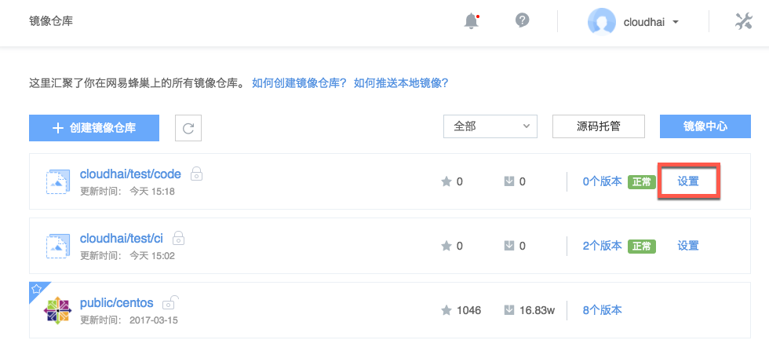
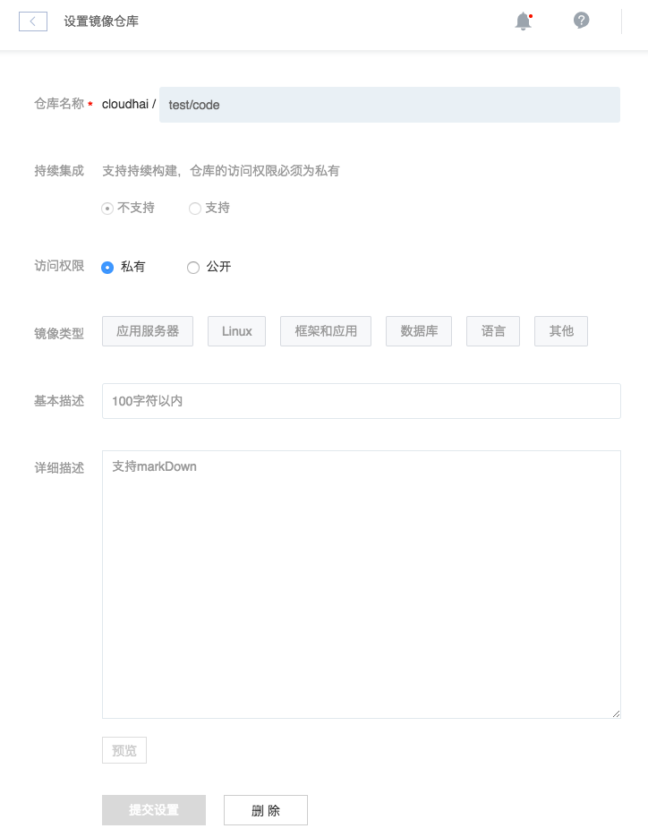

# 修改镜像仓库

支持修改以下内容：
* 访问权限（持续集成的镜像仓库不支持修改访问权限）
* 镜像类型标签
* 基本描述
* 详细描述

## 操作步骤

1. 登录 [控制台](https://c.163.com/dashboard#/m/mirrorRepo/)，定位「**镜像仓库**」标签；
2. 定位到需要修改的镜像仓库；
3. 点击右侧的「**设置**」按钮：

4. 修改对应内容，点击「提交设置」：
