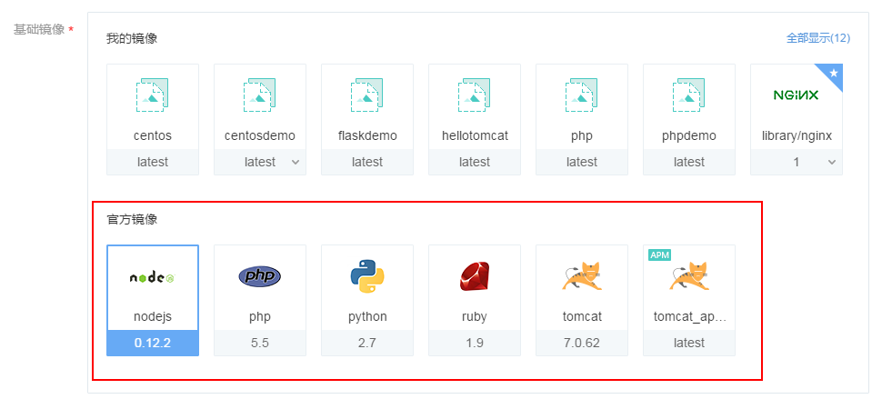
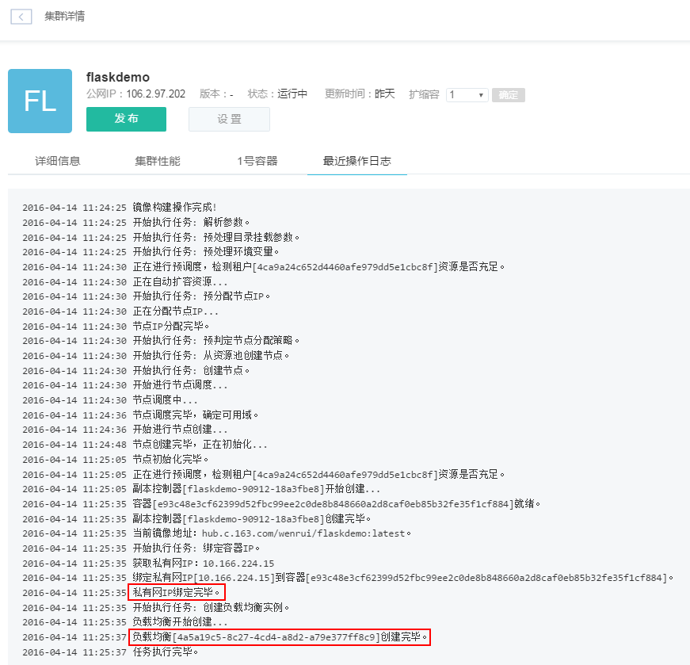
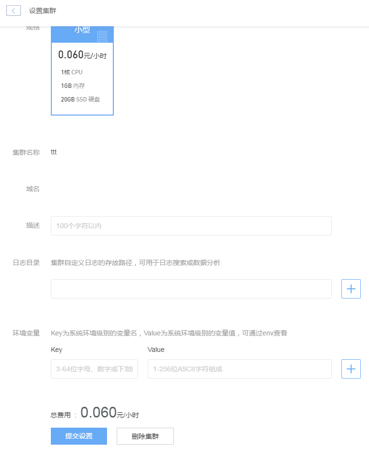

# 创建集群

## 创建集群

点击「创建集群」按钮，进入集群创建界面，如下图所示：

其中，加 * 字段为必填项。

### 基础镜像

基础镜像可选「我的镜像」或「官方镜像」。

**我的镜像**
我的镜像中为用户自定义的镜像以及在蜂巢镜像中心收藏的镜像，如下图所示。其中，收藏的镜像会在镜像右上角用星号标记。选择自定义镜像时，你无需指定代码托管地址，根据镜像可直接创建集群。自定义镜像其实是用户根据之前的集群创建的快照，这种方式操作更简单。注意：默认显示的镜像数量有限，你可以点击右上角「全部显示」查看所有镜像。

**官方镜像**
官方镜像的位置如下图所示：

选择官方镜像时，需要指定代码托管地址。目前已支持 SVN 与 Git 的托管方式，Public 和 Private 类型项目都支持，如下图所示。若为 Public，将用户名和密码留空，构建文件与 Dockerfile 采用系统推荐的自动生成选项即可，负载均衡默认为不使用；如果想让项目拥有公网 IP，需要选择「使用」如下图所示。日志目录和环境变量如非特殊需要，一般默认留空。

### 规格
你可以选择合适自己项目的规格套餐。未来蜂巢会陆续提供更多种规格套餐供你选择。

### 集群名称
填写集群名称，一般由 3~32 位字母或数字组成，以字母开头。

### 域名
填写域名后，并在 DNS 服务商绑定 A 记录，便可通过域名访问新建的集群。若其实并未拥有所填域名，也可在本地 hosts 文件中添加域名及对应集群负载均衡 IP，也可在本地通过域名进行访问。

### 环境变量
你可在创建容器过程中，将所填环境变量注入到即将生成的容器中，这样可以避免常用环境变量的重复添加。
填完基本的创建信息后，跳转到集群详情页面，稍等片刻便可构建完成。可通过「最近操作日志」查看构建的日志信息，构建成功便可看到如下日志信息，如下图所示：

倘若构建失败，则可能有如下原因：网络不通，代码托管的用户名与密码不匹配，服务器的资源不足等。如若使用公网访问功能，请先 [创建负载均衡](http://support.c.163.com/md.html#!计算服务/负载均衡-旧版/使用指南.md)并关联该集群到监听实例。

## 修改集群
集群的修改主要修改集群的一些配置参数，如负载均衡带宽、日志目录、环境变量等，也可修改项目地址。在集群列表中点击相应集群的「设置」按钮，进入「集群管理」页面，即可对集群进行修改，如下图所示：

## 发布集群

创建集群后，项目代码有改动，如果要部署新代码，点击「发布」按钮即可，这个步骤会重新从源码库里重新拉取代码，进行构建。

点击相应集群名称，进入集群详情页面，点击「最近操作日志」，可以看到具体的操作步骤，如下图所示：

## 集群扩缩容

在集群详情页面，设置集群所需的容器数，点击「确定」按钮后，开始进行扩缩容，此过程需一定时间：

## 删除集群

删除集群需谨慎操作。如果确实要删除不再使用的集群，可以进入集群设置页面，点击最下面的「删除集群」按钮进行删除即可，如下图所示：

