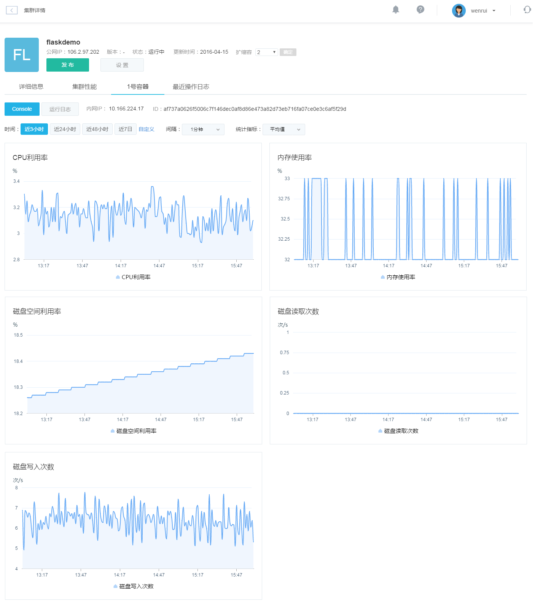
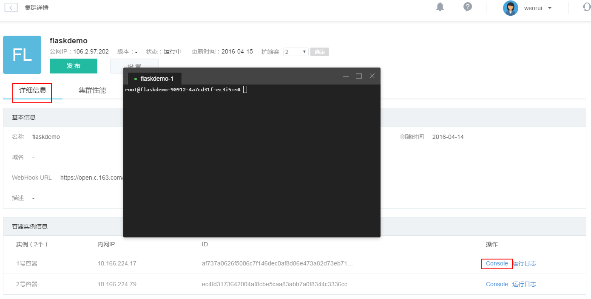

# 集群管理

点击网易蜂巢首页左侧的「集群管理」选项，显示当前用户的所有集群列表。

你可以在此创建集群，设置集群，查看集群状态等。点击集群名称，进入集群详情。

## 集群性能
 
集群性能包括 CPU 和内存两部分：

同时也可查看单个容器性能：

## 集群日志

集群日志主要包含三部分：最近操作日志、单个容器运行日志和单个容器命令行日志。

### 最近操作日志
在集群详情页面，点击「最近操作日志」标签，可查看到集群最近的操作日志：

### 运行日志
集群详情页面，在所有容器的 TAB 页中选择某个容器，可看到页面有「运行日志」，点击此按钮可查看运行日志。容器的详情和运行日志如下两图所示：

### 命令行日志
集群详情页面，在所有容器的 TAB 页中选择某容器，可看到页面有「命令行日志」，点击此按钮可查看运行日志：

## 版本管理

版本管理包含版本的回滚，查看某个版本的日志和镜像。在集群详情页面，点击「版本管理」进入版本管理弹框，如下图所示：

## 版本日志
在版本管理弹框中，要查看某个版本对应的版本日志，点击「日志」便可查看日志详情：

### 回滚操作
集群每次发布，都会产生一个新的版本，有一个版本号与之对应。用户如果想回到之前的某个发布版本，直接在对应版本点击「回滚」即可，如下图所示：

