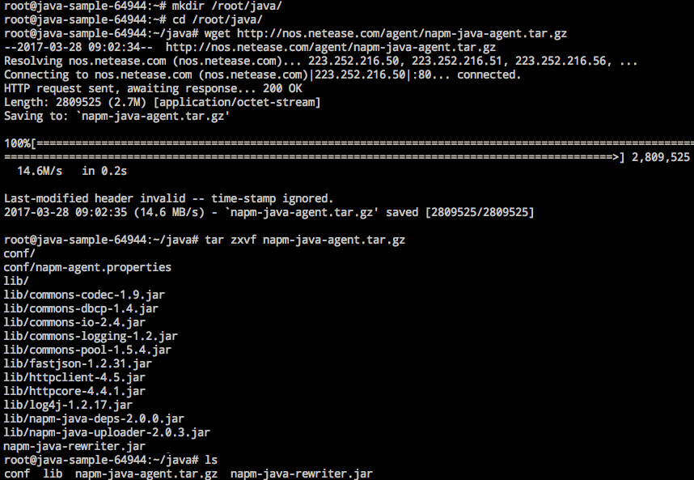
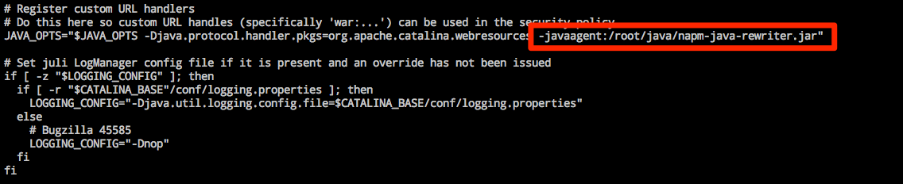
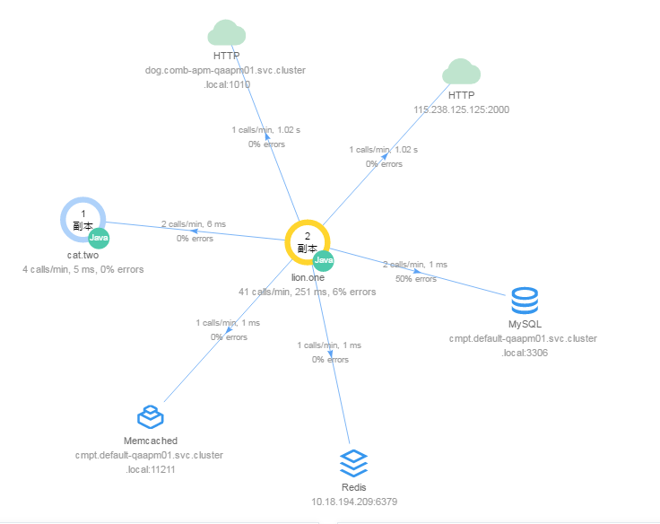
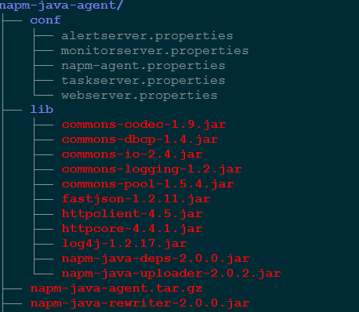

# 部署 Java 探针

<span>Note:</span><div class="alertContent">只需在容器服务中部署监测探针，即可实现业务的全链路跟踪和异常捕获</div>

本文以 Tomcat8 为例，介绍如何部署 Java 探针。

## 1. 直接在容器中部署探针

应用场景：用户已有运行的容器，希望在容器中部署探针，支持性能管理。

### 1.1. 下载探针安装包

打开目标实例的 WebConsle（或 SSH 目标实例），下载 [Java探针安装包](http://nos.netease.com/agent/napm-java-agent.tar.gz)：

	mkdir /root/java/
	cd /root/java/
	wget http://nos.netease.com/agent/napm-java-agent.tar.gz
	tar zxvf napm-java-agent.tar.gz



### 1.2. 增加 Java 启动参数

以 Tomcat8 为例，修改 `/taomcat8/bin/catalina.sh` 脚本，在 JAVA_OPTS 内添加 `-javaagent:<user_agent_dir>/napm-java-rewriter.jar` 启动参数。




### 1.3. 保存镜像

详见：[如何保存镜像](http://support.c.163.com/md.html#!计算服务/容器服务/使用指南/如何保存镜像.md) 。

### 1.4. 使用保存的镜像，更改无状态服务的镜像版本或重新创建服务

服务启动后，在性能监测模块可以看到全链路数据展示的变化。




## 2. 通过 Dockerfile 部署Java探针 

应用场景：代码已经上传到代码托管服务，并且项目中包含 Dockerfile 文件用于构建镜像。希望通过 Dockerfile 方部署探针。 

### 2.1. 在项目 Dockerfile 中增加探针安装内容

请确保安装了 wget 和 tar。

	...
	wget -P /root/java/ http://nos.netease.com/agent/napm-java-agent.tar.gz  
	tar zxvf /root/java/napm-java-agent.tar.gz
	...

### 2.2. 修改启动脚本

建议将启动脚本复制一份放到项目中（或放到桶里），修改启动脚本，添加参数 `--java-agent:<user_agent_dir>/napm-java-rewriter.jar`

### 2.3. Dockerfile 中 ADD 脚本

	...
	ADD catalina.sh /root/tomcat8/bin/
	...

### 2.4. 构建镜像

* 在蜂巢镜像仓库，通过 [代码构建镜像](http://support.c.163.com/md.html#!计算服务/镜像仓库/使用指南/创建自定义镜像.md)；
* 或在本地构建镜像后，[推送到蜂巢镜像仓库](http://support.c.163.com/md.html#!计算服务/镜像仓库/使用指南/推送本地镜像.md)。

### 2.5. 使用构建镜像，更改无状态服务的镜像版本或重新创建服务

服务启动后，在性能监测模块可以看到全链路数据展示的变化。


## 3. 任意主机上部署探针

### 3.1. 下载探针安装包

SSH 目标实例，下载 [Java探针安装包](http://nos.netease.com/agent/napm-java-agent.tar.gz )：

```
mkdir /root/java/
cd /root/java/
wget http://nos.netease.com/agent/napm-java-agent.tar.gz
tar zxvf napm-java-agent.tar.gz
```
/root/java/ 可按需替换


### 3.2. 修改配置文件

解压后的探针目录结构如下图所示：



解压探针的安装包后，需要在 napm-java-agent-conf 目录下新建配置文件（命名可参考上图），此处创建 webserver.properties（建议配置文件名和文件中的服务名一致），文件中需配置下面的参数：

	productId=46ba18075f004315908e0ec119b644cb-cloud-monitor-qaapm03

	# service为服务名（进程功能，如管理服务器，报警服务器等），为避免冲突，各模块以模块名开头命名，如：webServer，alertServer
	service=webserver


在配置文件中所需的字段可通过如下方式获取：

#### 3.2.1. 获取 productId

productId 由以下三部分组成：租户 id、空间名和用户名

* 获取租户 id：创建一个蜂巢的账号，之后可以通过工单的方式向我们的技术支持人员询问你的租户 id
* 创建空间：进入蜂巢官网-服务管理，创建一个空间如 cloud-monitor，创建后结果如图：
* 获取用户名：用户名在蜂巢控制台右上角可以查看，位置如图所示：

productId 的组成规则为：租户id-空间-用户名。在以上示例中，productId 应为：

	productId=tenantID-cloud-monitor-qaapm03

#### 3.2.2. service：

service 可以任意命名，但是建议和监控的服务进程名字相同，以 webserver 进程为例：

	service=webserver

### 3.3. 增加 Java 启动参数

修改配置文件后，需要在 tomcat 或 java 服务中添加启动参数，具体方式如下：

#### 3.3.1. Tomcat 部署服务添加参数

```
export CATALINA_OPTS='-javaagent:/usr/local/apm/napm-java-agent/napm-java-rewriter.jar=conf=webserver.properties'
```

或者修改 `/taomcat/bin/catalina.sh` 脚本，在 JAVA_OPTS 内添加启动参数
```
-javaagent:/usr/local/apm/napm-java-agent/napm-java-rewriter.jar=conf=webserver.properties
```


#### 3.3.2. Java服务添加参数

Java 服务启动时直接加上以下参数即可

```
-javaagent:/usr/local/apm/napm-java-agent/napm-java-rewriter.jar=conf=webserver.properties
```


