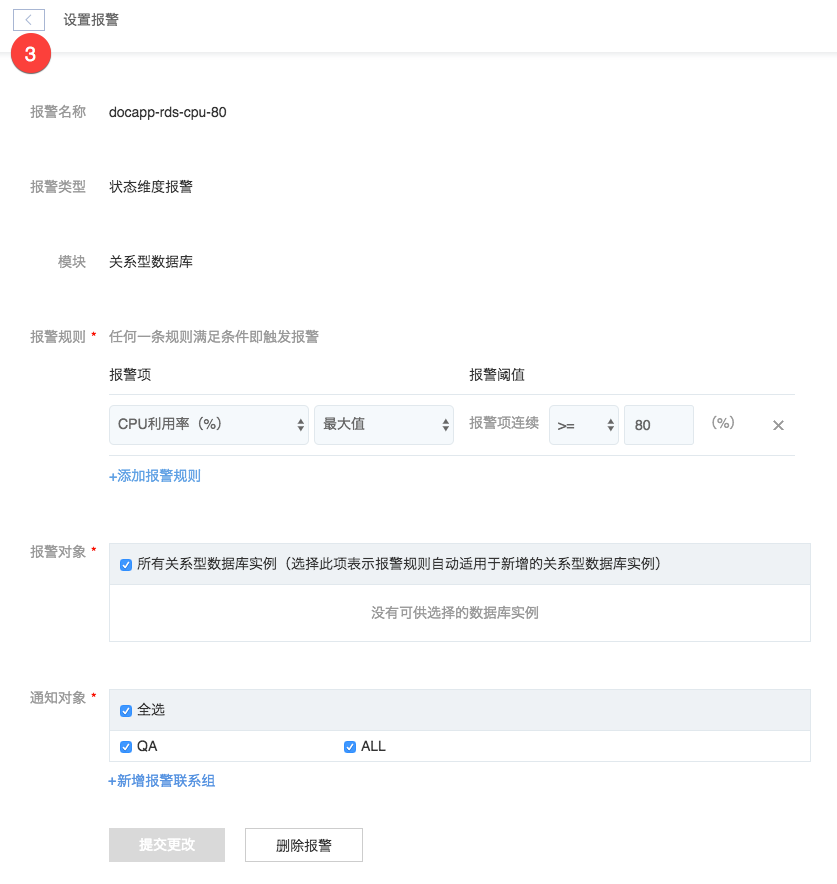

# 修改报警

支持修改以下内容：
* 报警项
* 报警对象
* 通知对象

## 操作步骤

1. 登录 [控制台](https://c.163.com/dashboard#/m/apm/alarm/)，点击「**监控**」导航，点击「**报警管理**」标签；
2. 点击右侧操作列的「**设置**」按钮；

3. 按需修改内容，也可以在此新增报警联系组，报警联系组相关操作详见：[报警联系组管理](../md.html#!运维工具/性能监控/报警管理使用指南/报警联系组/创建报警联系组.md)。

