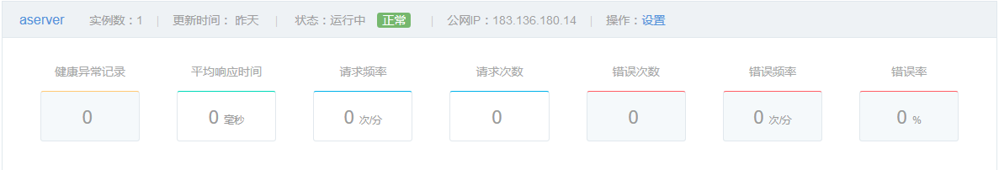
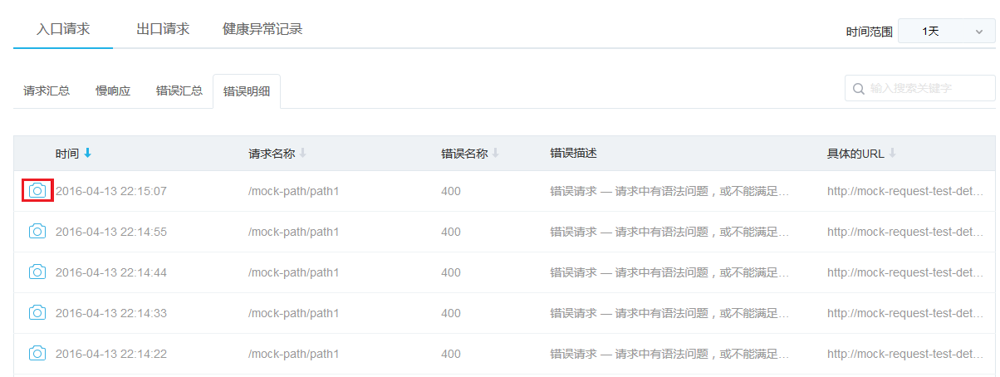

你可在监控服务中为账户所有的容器、服务和 RDS 实例创建并配置状态维度报警和事件报警，推送到指定手机和邮箱。监控首页展示已配置的报警列表，包含报警名称、报警针对的服务模块、报警对象、报警规则等信息。通过列表右上角的「选择模块」，可以筛选展示针对不同模块的报警。点击右侧操作栏中的「设置」，可以修改相应的报警配置。 

## 创建报警

点击监控首页左上角的「创建报警」，进入创建报警页面。按提示填写报警名称，选择报警类型。 

报警规则、对象和通知配置详情说明如下：

### 报警规则

#### 状态维度报警

当选择报警类型为状态维度报警时，可以在这里配置报警项和阈值，支持同时添加多条规则，满足其中任意一条时即触发报警。蜂巢默认提供了两条常用规则，你也可删除或修改后自行配置。注意：报警阈值聚合区间为 1 分钟，连续 5 个聚合区间达到阈值，触发报警。

#### 事件报警

当选择报警类型为事件报警时，可以在这里配置报警事件，支持同时添加多条事件，满足其中任意一条时即触发报警，如下图所示：

### 报警对象
选择了报警模块后，你在该模块中已创建的对象都会显示在报警对象一栏。倘若进行勾选，表示上述定义的报警规则适用该对象，默认全选。全选框被选定时，以后在该模块中新创建的对象也会自动适配该报警。 

### 报警通知
填写手机和邮箱用于接收报警信息，如下图所示： 

## 修改报警

在监控首页，点击「设置」进入设置报警页面。你可以对报警规则、报警对象和接收报警信息的手机、邮箱进行修改，各项配置详细说明请参看 **创建报警**。你还可以在该页面还可以删除报警。 

## 发现问题

性能监控通过探针的方式，分布式地采集集群运行数据，汇总到监控服务器。监控服务器记录、整理、分析性能数据，最后产生监控图表，展示给用户查看。

现有的监控图表有：[集群管理列表仪表盘](#1) 和 [集群性能仪表盘](#2) 集群性能仪盘表。

### 集群列表仪表盘

通过集群列表仪表盘，你可以看到一个集群 30 分钟内的性能数据指标，如下图所示，这些指标包括：
 * **健康异常记录**：超出规定指标的数据将被记录到健康异常中。
 * **平均响应时间**：入口请求在观察周期内的平均响应时间。
 * **请求频率、请求次数**：入口请求在观察周期内的请求次数和频率（按分钟计）。
 * **错误频率、错误次数、错误率**：入口请求在观察周期内的错误次数和频率（按分钟计），以及错误次数与请求次数的比例。

### 集群性能仪表盘

点击具体的集群实例，进入集群详情后，可以在集群性能仪表盘中看到下图，其中包括了：
* **拓扑图**：观察周期内，当前集群实例与其他集群实例或者第三方服务的拓扑关系，以及他们彼此间的请求频率和平均响应时间。
* **健康状态异常总览**：观察周期内健康事件的记录数。
* **慢响应总览折线图**：观察周期内，慢响应、极慢响应、无响应的请求数量变化趋势。
* **平均响应时间折线图**：观察周期内，平均响应时间变化趋势。
* **请求频率折线图**：观察周期内，请求频率的变化趋势。
* **错误率折线图**：观察周期内，错误比例的变化趋势。

性能监控可以采集到集群的多项数据指标，你可以根据这些指标定义健康判定规则（自定义功能暂未开放），同时蜂巢也根据多年的经验，设定了一些默认的健康判定规则。当集群监控通过健康规则判断，发现集群出现异常时，会产生健康异常通知，并在健康明细中进行记录。

## 定位问题

通过上面的图表，你可以快速判断系统是否出问题，以及问题的大致类型是什么。蜂巢还提供了丰富的明细图表和快照信息，帮助用你速定位问题，如下图所示：

通过明细图表,你可以看到：
*  每个访问的请求，具体的统计信息
*  慢的请求、出错的请求、以及健康异常事件的记录。

如果需要进一步确定问题的原因，还可以使用快照功能。异常记录前面若有照相机图标，表示蜂巢记录了这次异常记录的快照信息，如下图所示：

点击照相机图标，你可以看到这次请求处理中具体的调用链路、响应时长、以及报出的异常信息等快照信息。

## 监控自动化

根据性能监控采集的数据，你可以设置报警通知（目前未全部开放）。根据各类性能监测的事件、触发告警通知，你可以及时地通知到负责人处理运维问题。
  

