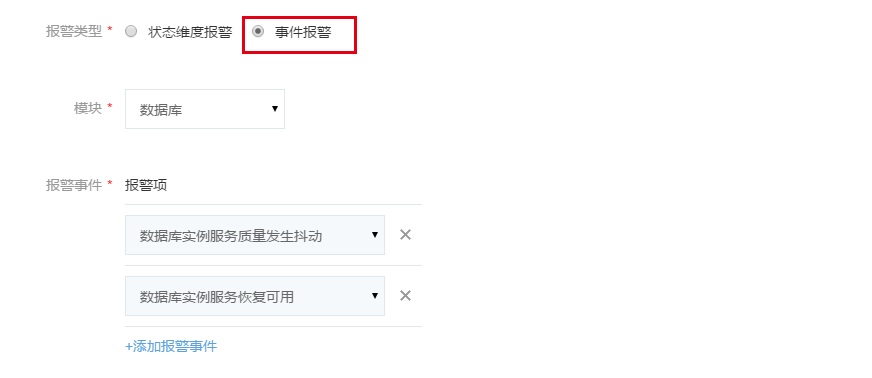

# 创建报警

你可在监控服务中为账户所有的容器、服务和 RDS 实例创建并配置状态维度报警和事件报警，推送到指定手机和邮箱。监控首页展示已配置的报警列表，包含报警名称、报警针对的服务模块、报警对象、报警规则等信息。通过列表右上角的「选择模块」，可以筛选展示针对不同模块的报警。点击右侧操作栏中的「设置」，可以修改相应的报警配置。 

## 创建报警

点击监控首页左上角的「创建报警」，进入创建报警页面。按提示填写报警名称，选择报警类型。 

报警规则、对象和通知配置详情说明如下：

### 报警规则

#### 状态维度报警

当选择报警类型为状态维度报警时，可以在这里配置报警项和阈值，支持同时添加多条规则，满足其中任意一条时即触发报警。蜂巢默认提供了两条常用规则，你也可删除或修改后自行配置。注意：报警阈值聚合区间为 1 分钟，连续 5 个聚合区间达到阈值，触发报警。

#### 事件报警

当选择报警类型为事件报警时，可以在这里配置报警事件，支持同时添加多条事件，满足其中任意一条时即触发报警，如下图所示：

### 报警对象
选择了报警模块后，你在该模块中已创建的对象都会显示在报警对象一栏。倘若进行勾选，表示上述定义的报警规则适用该对象，默认全选。全选框被选定时，以后在该模块中新创建的对象也会自动适配该报警。 

### 报警通知
填写手机和邮箱用于接收报警信息，如下图所示： 

## 修改报警

在监控首页，点击「设置」进入设置报警页面。你可以对报警规则、报警对象和接收报警信息的手机、邮箱进行修改，各项配置详细说明请参看 **创建报警**。你还可以在该页面还可以删除报警。 

