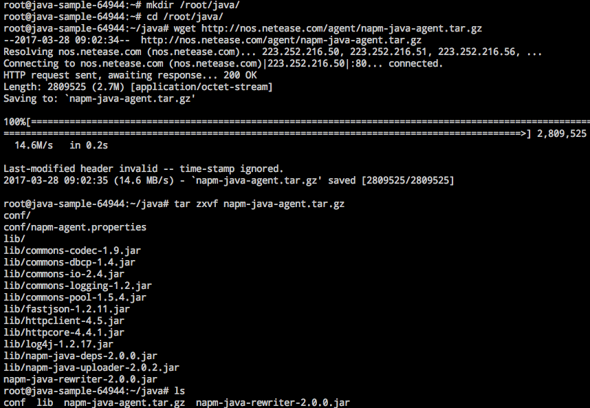
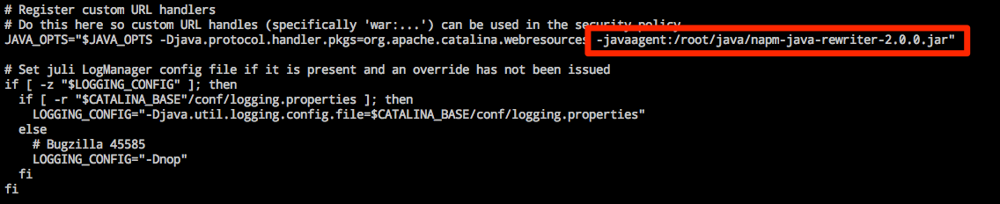
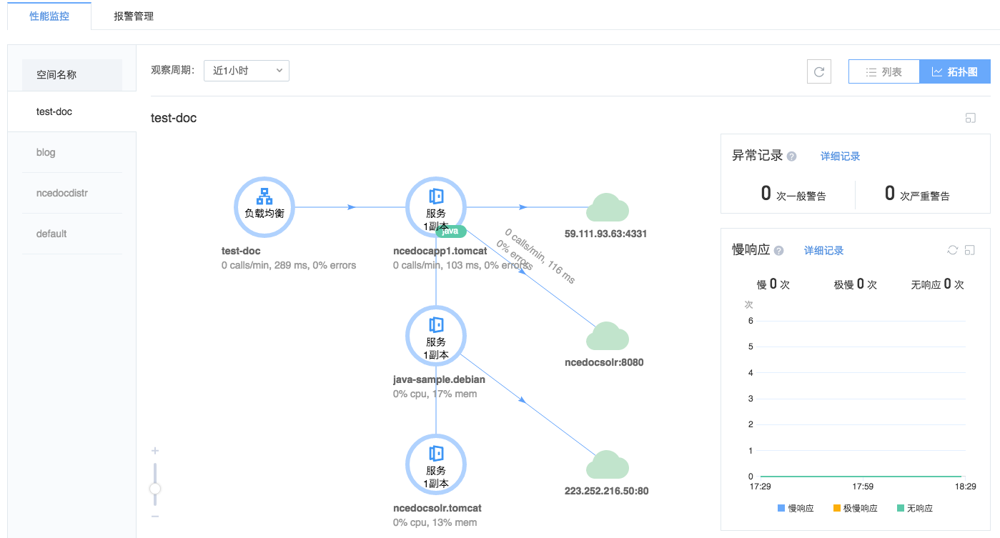

# 部署 Java 探针

Note:
只需在容器服务中部署监测探针，即可实现业务的全链路跟踪和异常捕获

本文以 Tomcat8 为例，介绍如何部署 Java 探针。

## 1. 直接在容器中部署探针

应用场景：用户已有运行的容器，希望在容器中部署探针，支持性能管理。

### 1.1. 下载探针安装包

打开目标实例的 WebConsle（或 SSH 目标实例），下载 [Java探针安装包](http://nos.netease.com/agent/napm-java-agent.tar.gz)：

	mkdir /root/java/
	cd /root/java/
	wget http://nos.netease.com/agent/napm-java-agent.tar.gz
	tar zxvf napm-java-agent.tar.gz

### 1.2. 增加 Java 启动参数

以 Tomcat8 为例，修改 `/taomcat8/bin/catalina.sh` 脚本，在 JAVA_OPTS 内添加 `-javaagent:<user_agent_dir>/napm-java-rewriter-2.0.0.jar` 启动参数。

### 1.3. 保存镜像

详见：[如何保存镜像](http://support.c.163.com/md.html#!容器服务/服务管理/使用指南/如何保存镜像.md) 。

### 1.4. 使用保存的镜像，更改无状态服务的镜像版本或重新创建服务

服务启动后，在性能监测模块可以看到全链路数据展示的变化。

## 2. 通过 Dockerfile 部署Java探针 

应用场景：代码已经上传到代码托管服务，并且项目中包含 Dockerfile 文件用于构建镜像。希望通过 Dockerfile 方部署探针。 

### 2.1. 在项目 Dockerfile 中增加探针安装内容

请确保安装了 wget 和 tar。

	...
	wget -P /root/java/ http://nos.netease.com/agent/napm-java-agent.tar.gz  
	tar zxvf /root/java/napm-java-agent.tar.gz
	...

### 2.2. 修改启动脚本

建议将启动脚本复制一份放到项目中（或放到桶里），修改启动脚本，添加参数 `--java-agent:<user_agent_dir>/napm-java-rewriter-2.0.0.jar`

### 2.3. Dockerfile 中 ADD 脚本

	...
	ADD catalina.sh /root/tomcat8/bin/
	...

### 2.4. 构建镜像

* 在蜂巢镜像仓库，通过 [代码构建镜像](http://support.c.163.com/md.html#!容器服务/镜像仓库/使用指南/创建自定义镜像.md)；
* 或在本地构建镜像后，[推送到蜂巢镜像仓库](http://support.c.163.com/md.html#!容器服务/镜像仓库/使用指南/推送本地镜像.md)。

### 2.5. 使用构建镜像，更改无状态服务的镜像版本或重新创建服务

服务启动后，在性能监测模块可以看到全链路数据展示的变化。

