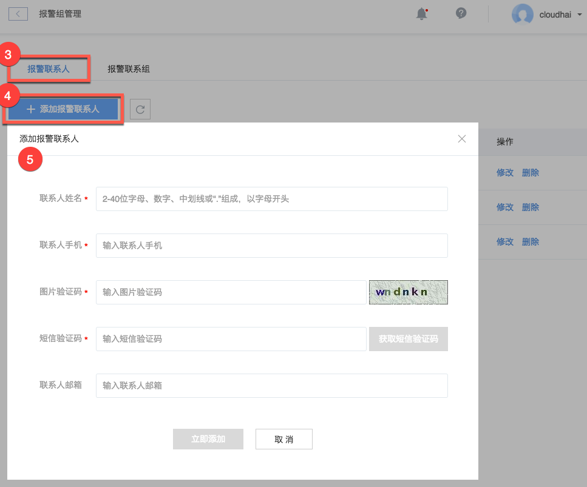

# 添加报警联系人

本文介绍如何将报警联系人添加至蜂巢系统中，报警联系人无法直接作为报警对象，需要先添加至联系组，详见：[创建报警联系组](../md.html#!运维工具/性能监控/报警管理使用指南/报警联系组/创建报警联系组.md)、[修改报警联系组](../md.html#!运维工具/性能监控/报警管理使用指南/报警联系组/修改报警联系组.md)。报警联系人与报警联系组是多对多关系，与报警没有直接关系。

## 操作步骤

1. 登录 [控制台](https://c.163.com/dashboard#/m/apm/alarm/)，点击「**监控**」导航，点击「**报警管理**」标签；
2. 在右侧点击「**报警组管理**」按钮：

3. 点击「**报警联系人**」标签；
4. 点击「**添加报警联系人**」按钮；
5. 填写联系人名称（唯一）、手机、邮箱（按需）、图片验证码，通过短信验证后，点击立即添加即可：

