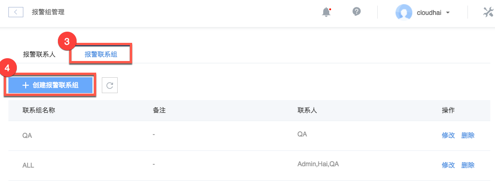
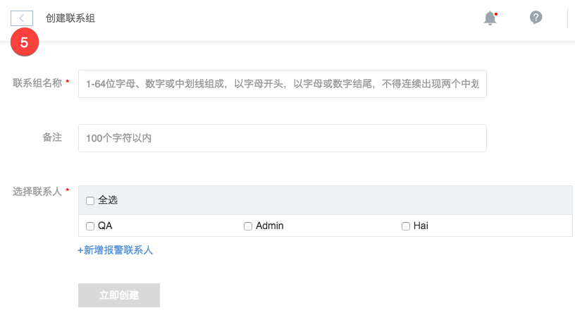

# 创建报警联系组

报警联系组与报警联系人是多对多关系；
报警联系组与报警是多对多关系；

## 操作步骤

1. 登录 [控制台](https://c.163.com/dashboard#/m/apm/alarm/)，点击「**监控**」导航，点击「**报警管理**」标签；
2. 在右侧点击「**报警组管理**」按钮：

3. 点击「**报警联系组**」标签；
4. 点击「**创建报警联系组**」按钮：

5. 填写联系组名称，选择联系人，点击立即创建：

