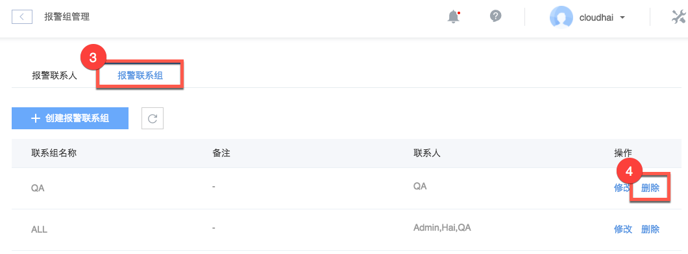

# 删除报警联系组

Attention:
已经与报警关联的报警联系组无法删除；删除后该组的报警联系人不会被删除。

## 操作步骤
1. 登录 [控制台](https://c.163.com/dashboard#/m/apm/alarm/)，点击「**监控**」导航，点击「**报警管理**」标签；
2. 在右侧点击「**报警组管理**」按钮：

3. 点击「**报警联系组**」标签；
4. 在右侧操作列，点击「**删除**」按钮：

