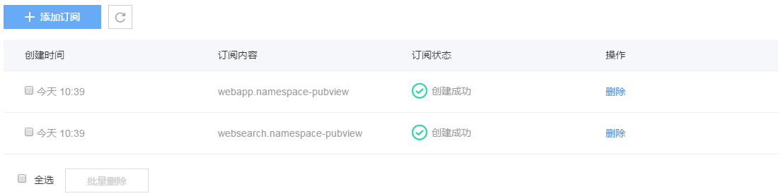

# 概览

日志订阅为用户提供了获取服务原始日志数据的功能。

用户在蜂巢平台上创建的服务，只要开启了日志订阅功能，都能通过日志订阅的 API 接口获取原始日志数据。

### 开启日志订阅步骤

蜂巢首页 -> 日志服务 -> 订阅日志 -> 选择需要订阅的空间和服务 -> 提交 -> 成功。

### 订阅方式

目前蜂巢日志服务暂时只提供 API 形式的日志订阅，后续我们会逐渐加上 SDK、一键存储到 NOS 等功能。

### 其他说明

* 日志订阅提供 RESTful 形式的 API 以供订阅
* 请访问 [服务入口](http://support.c.163.com/md.html#!运维工具/日志服务/API 手册/日志 API - 服务入口.md) 章节获取具体 API 的访问地址
* API 所有请求都需要做安全验证，请参考 [访问控制](http://support.c.163.com/md.html#!运维工具/日志服务/API 手册/日志 API - 访问控制.md) 章节了解具体的API请求签名机制及流程