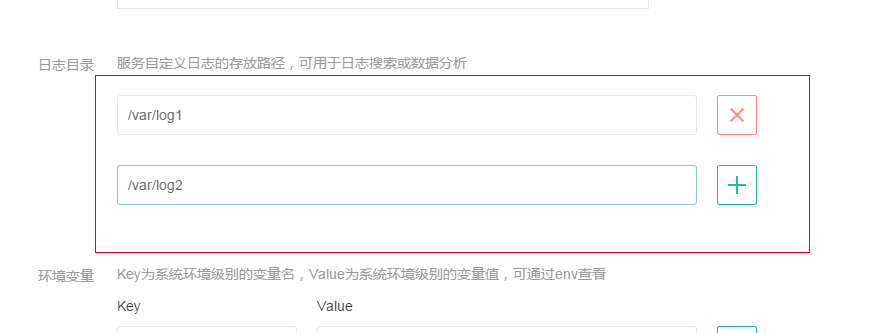
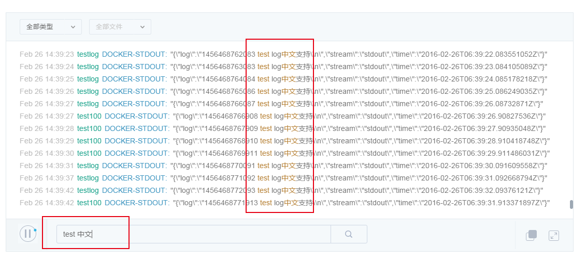

# 使用指南

## 收集范围

目前日志服务会收集有状态服务和无状态服务内容器产生的标准 Docker 输出信息和用户自定义日志目录下的日志文件信息。

Note:
请在创建服务时及时设置日志目录。
目前有状态服务创建完成后，不支持修改/添加日志目录。
无状态服务修改日志目录后，该目录内原有日志将被清空，请注意备份。

## 整体介绍
进入到控制台左侧菜单中的日志服务页面后，日志服务的功能从上到下依次为：

 1. 帮助文档 
 2. 日志分类、选择过滤框 
 3. 日志主体显示区域 
 4. 实时状态显示按钮 
 5. 搜索框 
 6. 主题更换按钮 
 7. 全屏按钮

如下图所示：

其中，

* 日志分类、选择过滤框可以按容器名、服务名以及日志文件名进行日志过滤；    
* 日志主体显示区域中，每行日志分别显示日志时间、容器/服务名、日志文件、日志内容； 
* 实时状态按钮可以控制实时展示或暂停；    
* 主题更换按钮可以进行日志展示风格的变换； 
* 全屏按钮可以控制阅读日志时的全屏及缩回。

## 集群、容器管理

创建集群或容器后，日志服务自动会开始对集群或容器产生的标准输出进行收集。此时，你可以直接到日志服务页面里进行查看，无需任何操作。

你可以选择需要查看的集群或者容器的相应日志，如下图所示（注意：刚创建的容器需要稍稍等待一段时间）:

选择某个集群或容器后,你可以再选择文件进行进一步的筛选。不过在容器中，文件通常仅有「DOCKER-STDOUT」。

## 标准输出

集群管理的标准输出日志同容器管理一致，可参考上述。

## 自定义日志目录

集群管理中比容器管理拥有一项更自由强大的功能，你可以自定义一个或多个日志输出目录。服务创建后，你只需往自定义目录里写入日志，就可以被日志服务收集到并进行后续的展示及处理。

自定义日志目录需在创建集群时指定，如下图所示：

## 搜索功能

日志服务可以在底层搜索框进行自由化的搜索，进行搜索后日志仍会实时的输出（只输出包含搜索条件的日志），方便你快速的定位日志中的内容，搜索命中的结果还会进行高亮的显示。

