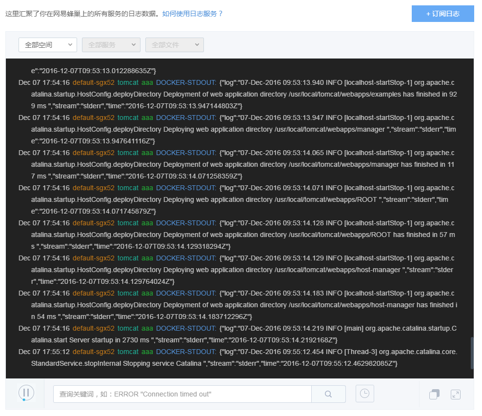

# 使用指南

## 收集范围

目前日志服务会收集有状态服务和无状态服务内容器产生的标准 Docker 输出信息和用户自定义日志目录下的日志文件信息。

Note:
请在创建服务时及时设置日志目录。
目前有状态服务创建完成后，不支持修改/添加日志目录。
无状态服务修改日志目录后，该目录内原有日志将被清空，请注意备份。

## 控制台使用

点击左侧的导航菜单「日志服务」，进入日志服务页面。

* 日志分类过滤框支持以空间名、服务名、日志文件名进行过滤；
* 日志主体显示区内，每行日志分别显示日志事件、服务名称、日志文件、日志内容；
* 实时状态按钮可以控制实时展示或暂停；
* 主题更换按钮可以进行日志展示风格的变换；
* 全屏按钮可以控制阅读日志时的全屏及缩回。

## 搜索功能

日志服务可以在底层搜索框进行自由化的搜索，进行搜索后日志仍会实时的输出（只输出包含搜索条件的日志），方便你快速的定位日志中的内容，搜索命中的结果还会进行高亮的显示。

## 日志订阅
详见 [如何订阅日志](http://support.c.163.com/md.html#!运维工具/日志服务/API 手册/日志 API - 概览.md)